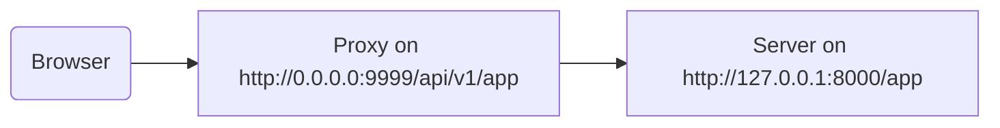

# پشت پروکسی

در برخی شرایط، ممکن است نیاز به استفاده از سرور **پروکسی** مانند Traefik یا Nginx با تنظیماتی داشته باشید که پیشوند مسیر اضافی‌ای اضافه می‌کند که توسط برنامه شما دیده نمی‌شود.

در این موارد می‌توانید از `root_path` برای پیکربندی برنامه خود استفاده کنید.

`root_path` مکانیزمی است که توسط مشخصه ASGI (که FastAPI بر اساس آن ساخته شده، از طریق Starlette) ارائه می‌شود.

`root_path` برای مدیریت این موارد خاص استفاده می‌شود.

و همچنین به صورت داخلی هنگام mount کردن زیر-برنامه‌ها استفاده می‌شود.

## پروکسی با پیشوند مسیر حذف شده

داشتن پروکسی با پیشوند مسیر حذف شده، در این مورد، به این معنی است که می‌توانید مسیری در `/app` در کد خود اعلان کنید، اما سپس لایه‌ای روی آن اضافه کنید (پروکسی) که برنامه **FastAPI** شما را زیر مسیری مانند `/api/v1` قرار دهد.

در این مورد، مسیر اصلی `/app` در واقع در `/api/v1/app` سرو خواهد شد.

حتی اگر همه کد شما با فرض اینکه فقط `/app` وجود دارد نوشته شده.

{* ../../docs_src/behind_a_proxy/tutorial001.py hl[6] *}

و پروکسی **پیشوند مسیر** را قبل از ارسال درخواست به سرور برنامه (احتمالاً Uvicorn از طریق FastAPI CLI) به صورت پویا **"حذف"** خواهد کرد، و برنامه شما را متقاعد نگه می‌دارد که در `/app` سرو می‌شود، تا نیازی نباشد همه کد خود را برای شامل کردن پیشوند `/api/v1` به‌روز کنید.

تا اینجا، همه چیز عادی کار خواهد کرد.

اما سپس، وقتی رابط کاربری مستندات یکپارچه (فرانت‌اند) را باز می‌کنید، انتظار دارد اسکیمای OpenAPI را در `/openapi.json` دریافت کند، به جای `/api/v1/openapi.json`.

بنابراین، فرانت‌اند (که در مرورگر اجرا می‌شود) سعی خواهد کرد به `/openapi.json` دسترسی پیدا کند و قادر به دریافت اسکیمای OpenAPI نخواهد بود.

چون ما پروکسی با پیشوند مسیر `/api/v1` برای برنامه خود داریم، فرانت‌اند باید اسکیمای OpenAPI را در `/api/v1/openapi.json` دریافت کند.



/// tip

IP `0.0.0.0` معمولاً به این معنی است که برنامه روی تمام IPهای موجود در آن ماشین/سرور گوش می‌دهد.

///

رابط کاربری مستندات همچنین نیاز دارد اسکیمای OpenAPI اعلان کند که این `server` API در `/api/v1` (پشت پروکسی) قرار دارد. برای مثال:

```JSON hl_lines="4-8"
{
    "openapi": "3.1.0",
    // More stuff here
    "servers": [
        {
            "url": "/api/v1"
        }
    ],
    "paths": {
            // More stuff here
    }
}
```

در این مثال، "پروکسی" می‌تواند چیزی مانند **Traefik** باشد. و سرور می‌تواند چیزی مانند FastAPI CLI با **Uvicorn** باشد که برنامه FastAPI شما را اجرا می‌کند.

### ارائه `root_path`

برای رسیدن به این هدف، می‌توانید از گزینه خط فرمان `--root-path` اینطور استفاده کنید:

<div class="termy">

```console
$ fastapi run main.py --root-path /api/v1

<span style="color: green;">INFO</span>:     Uvicorn running on http://127.0.0.1:8000 (Press CTRL+C to quit)
```

</div>

اگر از Hypercorn استفاده می‌کنید، آن هم گزینه `--root-path` دارد.

/// note | جزئیات فنی

مشخصه ASGI یک `root_path` برای این مورد استفاده تعریف می‌کند.

و گزینه خط فرمان `--root-path` آن `root_path` را ارائه می‌دهد.

///

### بررسی `root_path` فعلی

می‌توانید `root_path` فعلی مورد استفاده برنامه خود را برای هر درخواست دریافت کنید، بخشی از دیکشنری `scope` است (بخشی از مشخصه ASGI).

اینجا آن را فقط برای نمایش در پیام قرار می‌دهیم.

{* ../../docs_src/behind_a_proxy/tutorial001.py hl[8] *}

سپس، اگر Uvicorn را اینطور شروع کنید:

<div class="termy">

```console
$ fastapi run main.py --root-path /api/v1

<span style="color: green;">INFO</span>:     Uvicorn running on http://127.0.0.1:8000 (Press CTRL+C to quit)
```

</div>

پاسخ چیزی شبیه به این خواهد بود:

```JSON
{
    "message": "Hello World",
    "root_path": "/api/v1"
}
```

### تنظیم `root_path` در برنامه FastAPI

به عنوان جایگزین، اگر راهی برای ارائه گزینه خط فرمان مانند `--root-path` یا معادل آن ندارید، می‌توانید پارامتر `root_path` را هنگام ایجاد برنامه FastAPI تنظیم کنید:

{* ../../docs_src/behind_a_proxy/tutorial002.py hl[3] *}

ارسال `root_path` به `FastAPI` معادل ارسال گزینه خط فرمان `--root-path` به Uvicorn یا Hypercorn خواهد بود.

### درباره `root_path`

به خاطر داشته باشید که سرور (Uvicorn) از آن `root_path` برای هیچ چیز دیگری جز ارسال آن به برنامه استفاده نخواهد کرد.

اما اگر با مرورگر خود به <a href="http://127.0.0.1:8000" class="external-link" target="_blank">http://127.0.0.1:8000/app</a> بروید، پاسخ عادی را خواهید دید:

```JSON
{
    "message": "Hello World",
    "root_path": "/api/v1"
}
```

بنابراین، انتظار نخواهد داشت در `http://127.0.0.1:8000/api/v1/app` دسترسی پیدا شود.

Uvicorn انتظار خواهد داشت پروکسی به Uvicorn در `http://127.0.0.1:8000/app` دسترسی پیدا کند، و سپس مسئولیت اضافه کردن پیشوند اضافی `/api/v1` بر عهده پروکسی خواهد بود.

## درباره پروکسی‌ها با پیشوند مسیر حذف شده

به خاطر داشته باشید که پروکسی با پیشوند مسیر حذف شده فقط یکی از راه‌های پیکربندی آن است.

احتمالاً در بسیاری از موارد پیش‌فرض این خواهد بود که پروکسی پیشوند مسیر حذف شده‌ای نداشته باشد.

در چنین مواردی (بدون پیشوند مسیر حذف شده)، پروکسی روی چیزی مانند `https://myawesomeapp.com` گوش خواهد داد، و اگر مرورگر به `https://myawesomeapp.com/api/v1/app` برود و سرور شما (مثلاً Uvicorn) روی `http://127.0.0.1:8000` گوش دهد، پروکسی (بدون پیشوند مسیر حذف شده) به Uvicorn در همان مسیر دسترسی پیدا خواهد کرد: `http://127.0.0.1:8000/api/v1/app`.

## تست محلی با Traefik

می‌توانید به راحتی آزمایش را به صورت محلی با پیشوند مسیر حذف شده با استفاده از <a href="https://docs.traefik.io/" class="external-link" target="_blank">Traefik</a> اجرا کنید.

<a href="https://github.com/containous/traefik/releases" class="external-link" target="_blank">Traefik را دانلود کنید</a>، یک فایل باینری تکی است، می‌توانید فایل فشرده را استخراج و مستقیماً از ترمینال اجرا کنید.

سپس فایل `traefik.toml` با محتوای زیر ایجاد کنید:

```TOML hl_lines="3"
[entryPoints]
  [entryPoints.http]
    address = ":9999"

[providers]
  [providers.file]
    filename = "routes.toml"
```

این به Traefik می‌گوید روی پورت 9999 گوش دهد و از فایل دیگری `routes.toml` استفاده کند.

/// tip

از پورت 9999 به جای پورت استاندارد HTTP 80 استفاده می‌کنیم تا نیازی به اجرا با دسترسی مدیر (`sudo`) نداشته باشید.

///

حالا آن فایل دیگر `routes.toml` را ایجاد کنید:

```TOML hl_lines="5  12  20"
[http]
  [http.middlewares]

    [http.middlewares.api-stripprefix.stripPrefix]
      prefixes = ["/api/v1"]

  [http.routers]

    [http.routers.app-http]
      entryPoints = ["http"]
      service = "app"
      rule = "PathPrefix(`/api/v1`)"
      middlewares = ["api-stripprefix"]

  [http.services]

    [http.services.app]
      [http.services.app.loadBalancer]
        [[http.services.app.loadBalancer.servers]]
          url = "http://127.0.0.1:8000"
```

این فایل Traefik را برای استفاده از پیشوند مسیر `/api/v1` پیکربندی می‌کند.

و سپس Traefik درخواست‌های خود را به Uvicorn در حال اجرا روی `http://127.0.0.1:8000` هدایت خواهد کرد.

حالا Traefik را شروع کنید:

<div class="termy">

```console
$ ./traefik --configFile=traefik.toml

INFO[0000] Configuration loaded from file: /home/user/awesomeapi/traefik.toml
```

</div>

و حالا برنامه خود را با استفاده از گزینه `--root-path` شروع کنید:

<div class="termy">

```console
$ fastapi run main.py --root-path /api/v1

<span style="color: green;">INFO</span>:     Uvicorn running on http://127.0.0.1:8000 (Press CTRL+C to quit)
```

</div>

### بررسی پاسخ‌ها

حالا، اگر به URL با پورت Uvicorn بروید: <a href="http://127.0.0.1:8000/app" class="external-link" target="_blank">http://127.0.0.1:8000/app</a>، پاسخ عادی را خواهید دید:

```JSON
{
    "message": "Hello World",
    "root_path": "/api/v1"
}
```

/// tip

توجه کنید حتی اگر در `http://127.0.0.1:8000/app` به آن دسترسی پیدا می‌کنید، `root_path` برابر `/api/v1` را نشان می‌دهد که از گزینه `--root-path` گرفته شده.

///

و حالا URL با پورت Traefik شامل پیشوند مسیر را باز کنید: <a href="http://127.0.0.1:9999/api/v1/app" class="external-link" target="_blank">http://127.0.0.1:9999/api/v1/app</a>.

همان پاسخ را دریافت می‌کنیم:

```JSON
{
    "message": "Hello World",
    "root_path": "/api/v1"
}
```

اما این بار در URL با مسیر پیشوند ارائه شده توسط پروکسی: `/api/v1`.

البته، ایده اینجا این است که همه از طریق پروکسی به برنامه دسترسی پیدا کنند، بنابراین نسخه با پیشوند مسیر `/api/v1` نسخه "صحیح" است.

و نسخه بدون پیشوند مسیر (`http://127.0.0.1:8000/app`)، ارائه شده مستقیماً توسط Uvicorn، منحصراً برای دسترسی _پروکسی_ (Traefik) به آن خواهد بود.

این نشان می‌دهد چگونه پروکسی (Traefik) از پیشوند مسیر استفاده می‌کند و چگونه سرور (Uvicorn) از `root_path` گزینه `--root-path` استفاده می‌کند.

### بررسی رابط کاربری مستندات

اما اینجا بخش جالب است. ✨

راه "رسمی" دسترسی به برنامه از طریق پروکسی با پیشوند مسیر تعریف شده خواهد بود. بنابراین، همانطور که انتظار داریم، اگر رابط کاربری مستندات سرو شده مستقیماً توسط Uvicorn را بدون پیشوند مسیر در URL امتحان کنید، کار نخواهد کرد، زیرا انتظار دارد از طریق پروکسی دسترسی پیدا شود.

می‌توانید آن را در <a href="http://127.0.0.1:8000/docs" class="external-link" target="_blank">http://127.0.0.1:8000/docs</a> بررسی کنید:


اما اگر رابط کاربری مستندات را در URL "رسمی" با استفاده از پروکسی با پورت `9999`، در `/api/v1/docs` باز کنیم، به درستی کار می‌کند! 🎉

می‌توانید آن را در <a href="http://127.0.0.1:9999/api/v1/docs" class="external-link" target="_blank">http://127.0.0.1:9999/api/v1/docs</a> بررسی کنید:


دقیقاً همانطور که می‌خواستیم. ✔️

این به این دلیل است که FastAPI از این `root_path` برای ایجاد `server` پیش‌فرض در OpenAPI با URL ارائه شده توسط `root_path` استفاده می‌کند.

## سرورهای اضافی

/// warning

این یک مورد استفاده پیشرفته‌تر است. خیالتان راحت باشد و رد شوید.

///

به طور پیش‌فرض، **FastAPI** یک `server` در اسکیمای OpenAPI با URL مربوط به `root_path` ایجاد خواهد کرد.

اما می‌توانید `server`های جایگزین دیگری نیز ارائه دهید، برای مثال اگر بخواهید *همان* رابط کاربری مستندات با محیط‌های staging و production تعامل داشته باشد.

اگر لیست سفارشی `servers` ارسال کنید و `root_path` وجود داشته باشد (زیرا API شما پشت پروکسی است)، **FastAPI** یک "server" با این `root_path` در ابتدای لیست درج خواهد کرد.

برای مثال:

{* ../../docs_src/behind_a_proxy/tutorial003.py hl[4:7] *}

اسکیمای OpenAPI زیر را تولید خواهد کرد:

```JSON hl_lines="5-7"
{
    "openapi": "3.1.0",
    // More stuff here
    "servers": [
        {
            "url": "/api/v1"
        },
        {
            "url": "https://stag.example.com",
            "description": "Staging environment"
        },
        {
            "url": "https://prod.example.com",
            "description": "Production environment"
        }
    ],
    "paths": {
            // More stuff here
    }
}
```

/// tip

توجه کنید سرور تولید شده خودکار با مقدار `url` برابر `/api/v1` که از `root_path` گرفته شده.

///

در رابط کاربری مستندات در <a href="http://127.0.0.1:9999/api/v1/docs" class="external-link" target="_blank">http://127.0.0.1:9999/api/v1/docs</a> اینطور خواهد بود:


/// tip

رابط کاربری مستندات با سروری که انتخاب می‌کنید تعامل خواهد داشت.

///

### غیرفعال کردن سرور خودکار از `root_path`

اگر نمی‌خواهید **FastAPI** سرور خودکار با استفاده از `root_path` اضافه کند، می‌توانید از پارامتر `root_path_in_servers=False` استفاده کنید:

{* ../../docs_src/behind_a_proxy/tutorial004.py hl[9] *}

و سپس در اسکیمای OpenAPI گنجانده نخواهد شد.

## Mount کردن زیر-برنامه

اگر نیاز به mount کردن زیر-برنامه دارید (همانطور که در [زیر-برنامه‌ها - Mounts](sub-applications.md){.internal-link target=_blank} توضیح داده شده) در حالی که از پروکسی با `root_path` نیز استفاده می‌کنید، می‌توانید به طور عادی انجام دهید، همانطور که انتظار دارید.

FastAPI به صورت داخلی از `root_path` به طور هوشمندانه استفاده خواهد کرد، بنابراین فقط کار خواهد کرد. ✨
