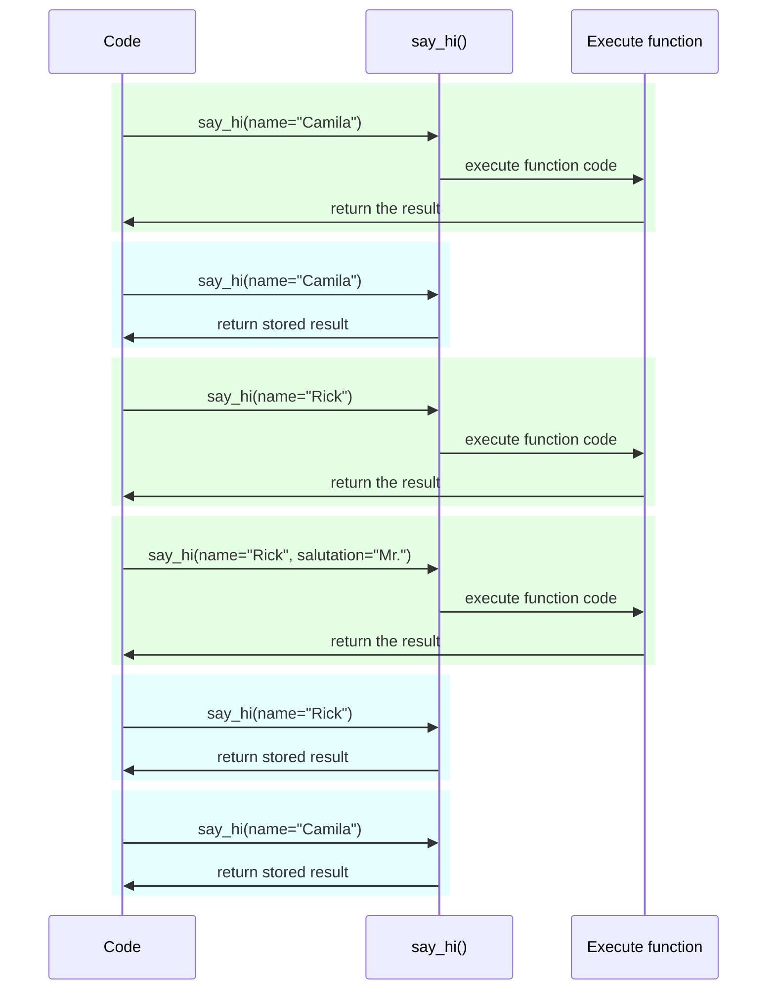

# تنظیمات و متغیرهای محیطی

در بسیاری از موارد برنامه شما ممکن است به برخی تنظیمات یا پیکربندی‌های خارجی نیاز داشته باشد، برای مثال کلیدهای مخفی، اعتبارنامه‌های پایگاه داده، اعتبارنامه‌های سرویس‌های ایمیل و غیره.

بیشتر این تنظیمات متغیر هستند (قابل تغییر)، مانند URLهای پایگاه داده. و بسیاری از آنها حساس هستند، مانند رازها.

به همین دلیل معمول است که آنها را در متغیرهای محیطی ارائه دهید که توسط برنامه خوانده می‌شوند.

/// tip

برای درک متغیرهای محیطی می‌توانید [متغیرهای محیطی](../environment-variables.md){.internal-link target=_blank} را بخوانید.

///

## تایپ‌ها و اعتبارسنجی

این متغیرهای محیطی فقط می‌توانند رشته‌های متنی را مدیریت کنند، زیرا خارج از Python هستند و باید با برنامه‌های دیگر و بقیه سیستم (و حتی با سیستم‌عامل‌های مختلف، مانند Linux، Windows، macOS) سازگار باشند.

این بدان معناست که هر مقدار خوانده شده در Python از یک متغیر محیطی یک `str` خواهد بود و هرگونه تبدیل به تایپ دیگر یا هرگونه اعتبارسنجی باید در کد انجام شود.

## `Settings` Pydantic

خوشبختانه، Pydantic یک ابزار عالی برای مدیریت این تنظیمات از متغیرهای محیطی با <a href="https://docs.pydantic.dev/latest/concepts/pydantic_settings/" class="external-link" target="_blank">Pydantic: مدیریت تنظیمات</a> ارائه می‌دهد.

### نصب `pydantic-settings`

ابتدا مطمئن شوید که [محیط مجازی](../virtual-environments.md){.internal-link target=_blank} خود را ایجاد کرده، آن را فعال کرده و سپس بسته `pydantic-settings` را نصب کنید:

<div class="termy">

```console
$ pip install pydantic-settings
---> 100%
```

</div>

همچنین هنگام نصب افزونه‌های `all` همراه می‌آید:

<div class="termy">

```console
$ pip install "fastapi[all]"
---> 100%
```

</div>

/// info

در Pydantic نسخه 1 با بسته اصلی ارائه می‌شد. اکنون به عنوان این بسته مستقل توزیع می‌شود تا بتوانید انتخاب کنید آن را نصب کنید یا نه اگر به آن عملکرد نیاز ندارید.

///

### ایجاد شیء `Settings`

`BaseSettings` را از Pydantic وارد کنید و یک زیرکلاس ایجاد کنید، بسیار شبیه به یک مدل Pydantic.

به همان روش مدل‌های Pydantic، صفات کلاس را با حاشیه‌نویسی تایپ و احتمالاً مقادیر پیش‌فرض اعلام می‌کنید.

می‌توانید از تمام ویژگی‌ها و ابزارهای اعتبارسنجی مشابهی که برای مدل‌های Pydantic استفاده می‌کنید استفاده کنید، مانند تایپ‌های داده مختلف و اعتبارسنجی‌های اضافی با `Field()`.

//// tab | Pydantic v2

{* ../../docs_src/settings/tutorial001.py hl[2,5:8,11] *}

////

//// tab | Pydantic v1

/// info

در Pydantic نسخه 1، `BaseSettings` را مستقیماً از `pydantic` به جای `pydantic_settings` وارد می‌کردید.

///

{* ../../docs_src/settings/tutorial001_pv1.py hl[2,5:8,11] *}

////

/// tip

اگر چیزی سریع برای کپی و چسباندن می‌خواهید، از این مثال استفاده نکنید، از آخرین مثال در زیر استفاده کنید.

///

سپس، هنگامی که یک نمونه از آن کلاس `Settings` ایجاد می‌کنید (در این مورد، در شیء `settings`)، Pydantic متغیرهای محیطی را به صورت غیرحساس به حروف بزرگ و کوچک خواهد خواند، بنابراین یک متغیر با حروف بزرگ `APP_NAME` همچنان برای صفت `app_name` خوانده خواهد شد.

سپس داده‌ها را تبدیل و اعتبارسنجی خواهد کرد. بنابراین، هنگام استفاده از آن شیء `settings`، داده‌هایی از تایپ‌هایی که اعلام کرده‌اید خواهید داشت (مثلاً `items_per_user` یک `int` خواهد بود).

### استفاده از `settings`

سپس می‌توانید از شیء جدید `settings` در برنامه خود استفاده کنید:

{* ../../docs_src/settings/tutorial001.py hl[18:20] *}

### اجرای سرور

سپس، سرور را با ارسال پیکربندی‌ها به عنوان متغیرهای محیطی اجرا می‌کنید، برای مثال می‌توانید `ADMIN_EMAIL` و `APP_NAME` را تنظیم کنید:

<div class="termy">

```console
$ ADMIN_EMAIL="deadpool@example.com" APP_NAME="ChimichangApp" fastapi run main.py

<span style="color: green;">INFO</span>:     Uvicorn running on http://127.0.0.1:8000 (Press CTRL+C to quit)
```

</div>

/// tip

برای تنظیم چندین متغیر محیطی برای یک دستور، فقط آنها را با فاصله جدا کنید و همه را قبل از دستور قرار دهید.

///

و سپس تنظیم `admin_email` به `"deadpool@example.com"` تنظیم خواهد شد.

`app_name` برابر `"ChimichangApp"` خواهد بود.

و `items_per_user` مقدار پیش‌فرض خود `50` را حفظ خواهد کرد.

## تنظیمات در ماژول دیگر

می‌توانید آن تنظیمات را در فایل ماژول دیگری قرار دهید همانطور که در [برنامه‌های بزرگ‌تر - چندین فایل](../tutorial/bigger-applications.md){.internal-link target=_blank} دیدید.

برای مثال، می‌توانید فایلی به نام `config.py` داشته باشید:

{* ../../docs_src/settings/app01/config.py *}

و سپس از آن در فایل `main.py` استفاده کنید:

{* ../../docs_src/settings/app01/main.py hl[3,11:13] *}

/// tip

همچنین به فایل `__init__.py` نیاز خواهید داشت همانطور که در [برنامه‌های بزرگ‌تر - چندین فایل](../tutorial/bigger-applications.md){.internal-link target=_blank} دیدید.

///

## تنظیمات در یک وابستگی

در برخی مواقع ممکن است ارائه تنظیمات از یک وابستگی مفید باشد، به جای داشتن یک شیء سراسری `settings` که همه جا استفاده شود.

این می‌تواند به ویژه در حین تست مفید باشد، زیرا بازنویسی یک وابستگی با تنظیمات سفارشی خود بسیار آسان است.

### فایل پیکربندی

با توجه به مثال قبلی، فایل `config.py` شما می‌تواند به این شکل باشد:

{* ../../docs_src/settings/app02/config.py hl[10] *}

توجه کنید که اکنون نمونه پیش‌فرض `settings = Settings()` ایجاد نمی‌کنیم.

### فایل اصلی برنامه

اکنون یک وابستگی ایجاد می‌کنیم که `config.Settings()` جدیدی برمی‌گرداند.

{* ../../docs_src/settings/app02_an_py39/main.py hl[6,12:13] *}

/// tip

درباره `@lru_cache` کمی بعد صحبت خواهیم کرد.

فعلاً فرض کنید `get_settings()` یک تابع عادی است.

///

و سپس می‌توانیم آن را از *تابع عملیات مسیر* به عنوان وابستگی درخواست کنیم و هر جا نیاز است استفاده کنیم.

{* ../../docs_src/settings/app02_an_py39/main.py hl[17,19:21] *}

### تنظیمات و تست

سپس ارائه یک شیء تنظیمات متفاوت در حین تست بسیار آسان خواهد بود با ایجاد یک بازنویسی وابستگی برای `get_settings`:

{* ../../docs_src/settings/app02/test_main.py hl[9:10,13,21] *}

در بازنویسی وابستگی، مقدار جدیدی برای `admin_email` هنگام ایجاد شیء جدید `Settings` تنظیم می‌کنیم و سپس آن شیء جدید را برمی‌گردانیم.

سپس می‌توانیم تست کنیم که از آن استفاده شده است.

## خواندن فایل `.env`

اگر تنظیمات زیادی دارید که ممکن است زیاد تغییر کنند، شاید در محیط‌های مختلف، ممکن است مفید باشد آنها را در یک فایل قرار دهید و سپس از آن به عنوان متغیرهای محیطی بخوانید.

این عمل به اندازه کافی رایج است که نامی دارد، این متغیرهای محیطی معمولاً در فایلی به نام `.env` قرار می‌گیرند و فایل "dotenv" نامیده می‌شود.

/// tip

فایلی که با نقطه (`.`) شروع می‌شود یک فایل مخفی در سیستم‌های شبه یونیکس مانند Linux و macOS است.

اما فایل dotenv واقعاً لازم نیست دقیقاً آن نام فایل را داشته باشد.

///

Pydantic با استفاده از یک کتابخانه خارجی از خواندن این نوع فایل‌ها پشتیبانی می‌کند. می‌توانید بیشتر در <a href="https://docs.pydantic.dev/latest/concepts/pydantic_settings/#dotenv-env-support" class="external-link" target="_blank">Pydantic Settings: پشتیبانی Dotenv (.env)</a> بخوانید.

/// tip

برای اینکه کار کند، باید `pip install python-dotenv` کنید.

///

### فایل `.env`

می‌توانید فایل `.env` داشته باشید با:

```bash
ADMIN_EMAIL="deadpool@example.com"
APP_NAME="ChimichangApp"
```

### خواندن تنظیمات از `.env`

و سپس `config.py` خود را به‌روز کنید:

//// tab | Pydantic v2

{* ../../docs_src/settings/app03_an/config.py hl[9] *}

/// tip

صفت `model_config` فقط برای پیکربندی Pydantic استفاده می‌شود. می‌توانید بیشتر در <a href="https://docs.pydantic.dev/latest/concepts/config/" class="external-link" target="_blank">Pydantic: مفاهیم: پیکربندی</a> بخوانید.

///

////

//// tab | Pydantic v1

{* ../../docs_src/settings/app03_an/config_pv1.py hl[9:10] *}

/// tip

کلاس `Config` فقط برای پیکربندی Pydantic استفاده می‌شود. می‌توانید بیشتر در <a href="https://docs.pydantic.dev/1.10/usage/model_config/" class="external-link" target="_blank">Pydantic Model Config</a> بخوانید.

///

////

/// info

در Pydantic نسخه 1 پیکربندی در یک کلاس داخلی `Config` انجام می‌شد، در Pydantic نسخه 2 در صفت `model_config` انجام می‌شود. این صفت یک `dict` می‌پذیرد و برای دریافت تکمیل خودکار و خطاهای درون‌خطی می‌توانید `SettingsConfigDict` را وارد و استفاده کنید تا آن `dict` را تعریف کنید.

///

اینجا پیکربندی `env_file` را در داخل کلاس `Settings` Pydantic خود تعریف می‌کنیم و مقدار را به نام فایل dotenv مورد نظر تنظیم می‌کنیم.

### ایجاد `Settings` فقط یک بار با `lru_cache`

خواندن فایل از دیسک معمولاً یک عملیات پرهزینه (کند) است، بنابراین احتمالاً می‌خواهید فقط یک بار انجام شود و سپس همان شیء تنظیمات را مجدداً استفاده کنید، به جای خواندن آن برای هر درخواست.

اما هر بار که:

```Python
Settings()
```

انجام دهیم، یک شیء جدید `Settings` ایجاد می‌شود و در زمان ایجاد فایل `.env` را دوباره می‌خواند.

اگر تابع وابستگی فقط به این شکل بود:

```Python
def get_settings():
    return Settings()
```

آن شیء را برای هر درخواست ایجاد می‌کردیم و فایل `.env` را برای هر درخواست می‌خواندیم. ⚠️

اما چون از دکوراتور `@lru_cache` در بالا استفاده می‌کنیم، شیء `Settings` فقط یک بار، اولین بار که فراخوانی می‌شود ایجاد خواهد شد. ✔️

{* ../../docs_src/settings/app03_an_py39/main.py hl[1,11] *}

سپس برای هر فراخوانی بعدی `get_settings()` در وابستگی‌ها برای درخواست‌های بعدی، به جای اجرای کد داخلی `get_settings()` و ایجاد شیء جدید `Settings`، همان شیءای که در اولین فراخوانی برگردانده شد، دوباره و دوباره برگردانده خواهد شد.

#### جزئیات فنی `lru_cache`

`@lru_cache` تابعی که تزئین می‌کند را تغییر می‌دهد تا همان مقداری که اولین بار برگردانده شده را برگرداند، به جای محاسبه مجدد آن و اجرای کد تابع هر بار.

بنابراین، تابع زیر آن یک بار برای هر ترکیب از آرگومان‌ها اجرا خواهد شد. و سپس مقادیر برگردانده شده توسط هر یک از آن ترکیبات آرگومان‌ها دوباره و دوباره هر زمان که تابع با دقیقاً همان ترکیب آرگومان‌ها فراخوانی شود استفاده خواهد شد.

برای مثال، اگر تابعی دارید:

```Python
@lru_cache
def say_hi(name: str, salutation: str = "Ms."):
    return f"Hello {salutation} {name}"
```

برنامه شما می‌تواند به این شکل اجرا شود:



در مورد وابستگی ما `get_settings()`، تابع حتی هیچ آرگومانی نمی‌گیرد، بنابراین همیشه همان مقدار را برمی‌گرداند.

به این ترتیب، تقریباً به گونه‌ای رفتار می‌کند که انگار فقط یک متغیر سراسری است. اما چون از تابع وابستگی استفاده می‌کند، می‌توانیم آن را برای تست به راحتی بازنویسی کنیم.

`@lru_cache` بخشی از `functools` است که بخشی از کتابخانه استاندارد Python است، می‌توانید بیشتر درباره آن در <a href="https://docs.python.org/3/library/functools.html#functools.lru_cache" class="external-link" target="_blank">مستندات Python برای `@lru_cache`</a> بخوانید.

## خلاصه

می‌توانید از Pydantic Settings برای مدیریت تنظیمات یا پیکربندی‌های برنامه خود استفاده کنید، با تمام قدرت مدل‌های Pydantic.

* با استفاده از وابستگی می‌توانید تست را ساده‌تر کنید.
* می‌توانید از فایل‌های `.env` با آن استفاده کنید.
* استفاده از `@lru_cache` اجازه می‌دهد از خواندن مجدد فایل dotenv برای هر درخواست جلوگیری کنید، در حالی که اجازه می‌دهد آن را در حین تست بازنویسی کنید.
