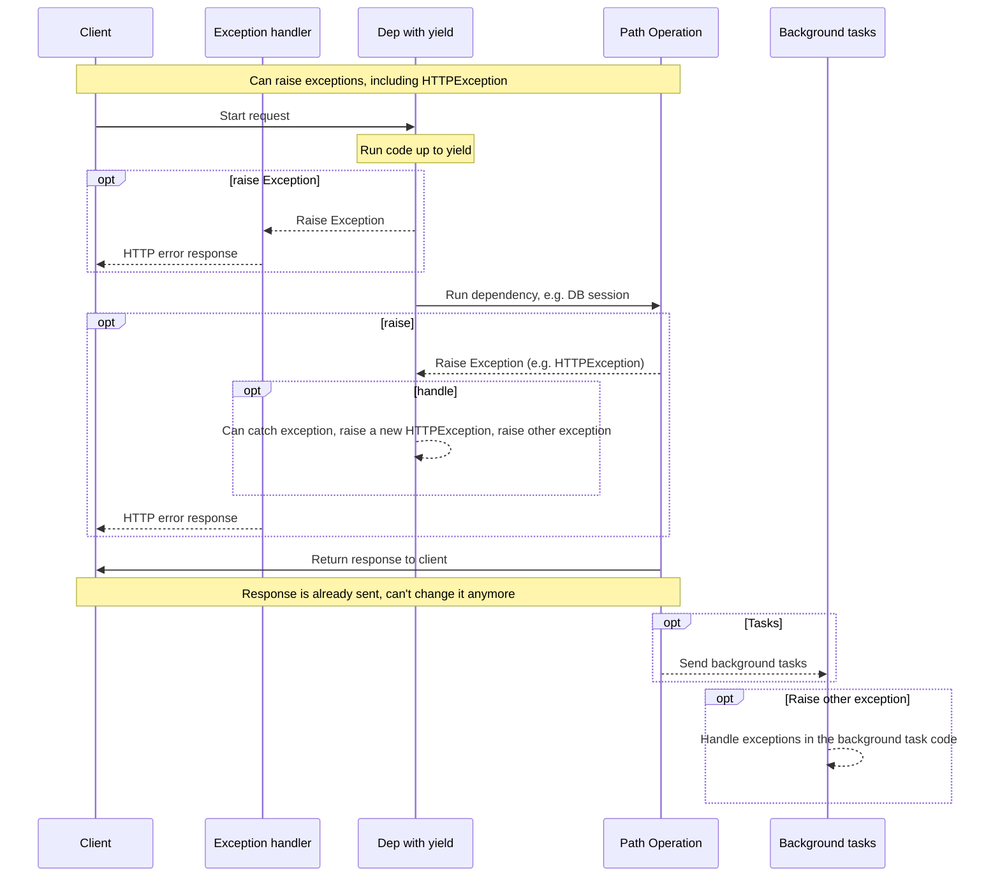

# وابستگی‌ها با yield

FastAPI از وابستگی‌هایی پشتیبانی می‌کند که <abbr title='گاهی "exit code"، "cleanup code"، "teardown code"، "closing code"، "context manager exit code" و غیره نیز نامیده می‌شود'>مراحل اضافی بعد از اتمام</abbr> انجام می‌دهند.

برای انجام این کار، از `yield` به جای `return` استفاده کنید و مراحل اضافی (کد) را بعد از آن بنویسید.

/// tip

مطمئن شوید که از `yield` فقط یک بار در هر وابستگی استفاده کنید.

///

/// note | جزئیات فنی

هر تابعی که برای استفاده با:

* <a href="https://docs.python.org/3/library/contextlib.html#contextlib.contextmanager" class="external-link" target="_blank">`@contextlib.contextmanager`</a> یا
* <a href="https://docs.python.org/3/library/contextlib.html#contextlib.asynccontextmanager" class="external-link" target="_blank">`@contextlib.asynccontextmanager`</a>

معتبر باشد، به عنوان یک وابستگی **FastAPI** نیز معتبر است.

در واقع، FastAPI از این دو دکوراتور به صورت داخلی استفاده می‌کند.

///

## یک وابستگی پایگاه داده با `yield`

به عنوان مثال، می‌توانید از این برای ایجاد یک نشست پایگاه داده و بستن آن پس از اتمام استفاده کنید.

فقط کد قبل و شامل دستور `yield` قبل از ایجاد یک پاسخ اجرا می‌شود:

{* ../../docs_src/dependencies/tutorial007.py hl[2:4] *}

مقدار yield شده چیزی است که به *عملیات‌های مسیر* و سایر وابستگی‌ها تزریق می‌شود:

{* ../../docs_src/dependencies/tutorial007.py hl[4] *}

کد بعد از دستور `yield` پس از ایجاد پاسخ اما قبل از ارسال آن اجرا می‌شود:

{* ../../docs_src/dependencies/tutorial007.py hl[5:6] *}

/// tip

می‌توانید از توابع `async` یا معمولی استفاده کنید.

**FastAPI** با هر کدام کار درست را انجام می‌دهد، همانند وابستگی‌های معمولی.

///

## یک وابستگی با `yield` و `try`

اگر از یک بلاک `try` در وابستگی با `yield` استفاده کنید، هر استثنایی که هنگام استفاده از وابستگی ایجاد شده باشد را دریافت خواهید کرد.

به عنوان مثال، اگر کدی در نقطه‌ای میانی، در وابستگی دیگری یا در یک *عملیات مسیر*، یک تراکنش پایگاه داده را "rollback" کند یا خطای دیگری ایجاد کند، استثنا را در وابستگی خود دریافت خواهید کرد.

بنابراین، می‌توانید آن استثنای خاص را در داخل وابستگی با `except SomeException` جستجو کنید.

به همین ترتیب، می‌توانید از `finally` استفاده کنید تا مطمئن شوید مراحل خروج اجرا می‌شوند، صرف‌نظر از اینکه استثنایی بود یا نه.

{* ../../docs_src/dependencies/tutorial007.py hl[3,5] *}

## زیروابستگی‌ها با `yield`

می‌توانید زیروابستگی‌ها و "درخت‌هایی" از زیروابستگی‌ها با هر اندازه و شکلی داشته باشید، و همه یا هر کدام از آنها می‌توانند از `yield` استفاده کنند.

**FastAPI** مطمئن خواهد شد که "کد خروج" در هر وابستگی با `yield` به ترتیب صحیح اجرا شود.

به عنوان مثال، `dependency_c` می‌تواند وابستگی به `dependency_b` داشته باشد، و `dependency_b` به `dependency_a`:

{* ../../docs_src/dependencies/tutorial008_an_py39.py hl[6,14,22] *}

و همه آنها می‌توانند از `yield` استفاده کنند.

در این مورد `dependency_c`، برای اجرای کد خروج خود، نیاز دارد مقدار از `dependency_b` (اینجا با نام `dep_b`) همچنان در دسترس باشد.

و به نوبه خود، `dependency_b` نیاز دارد مقدار از `dependency_a` (اینجا با نام `dep_a`) برای کد خروج خود در دسترس باشد.

{* ../../docs_src/dependencies/tutorial008_an_py39.py hl[18:19,26:27] *}

به همین ترتیب، می‌توانید برخی وابستگی‌ها را با `yield` و برخی دیگر را با `return` داشته باشید، و برخی از آنها به برخی دیگر وابسته باشند.

و می‌توانید یک وابستگی واحد داشته باشید که به چندین وابستگی دیگر با `yield` نیاز دارد و غیره.

هر ترکیبی از وابستگی‌ها که بخواهید می‌توانید داشته باشید.

**FastAPI** مطمئن خواهد شد همه چیز به ترتیب صحیح اجرا شود.

/// note | جزئیات فنی

این به لطف <a href="https://docs.python.org/3/library/contextlib.html" class="external-link" target="_blank">Context Manager</a>‌های پایتون کار می‌کند.

**FastAPI** از آنها به صورت داخلی برای دستیابی به این امر استفاده می‌کند.

///

## وابستگی‌ها با `yield` و `HTTPException`

دیدید که می‌توانید از وابستگی‌ها با `yield` استفاده کنید و بلاک‌های `try` داشته باشید که استثناها را بگیرند.

به همین ترتیب، می‌توانید یک `HTTPException` یا مشابه آن را در کد خروج، بعد از `yield` ایجاد کنید.

/// tip

این یک تکنیک تا حدودی پیشرفته است، و در اکثر موارد واقعاً به آن نیاز نخواهید داشت، زیرا می‌توانید استثناها (از جمله `HTTPException`) را از داخل بقیه کد برنامه خود ایجاد کنید، به عنوان مثال، در *تابع عملیات مسیر*.

اما در صورت نیاز برایتان موجود است. 🤓

///

{* ../../docs_src/dependencies/tutorial008b_an_py39.py hl[18:22,31] *}

یک جایگزین که می‌توانید برای گرفتن استثناها (و احتمالاً ایجاد یک `HTTPException` دیگر) استفاده کنید، ایجاد یک [کنترل‌کننده استثنای سفارشی](../handling-errors.md#install-custom-exception-handlers){.internal-link target=_blank} است.

## وابستگی‌ها با `yield` و `except`

اگر یک استثنا را با `except` در وابستگی با `yield` بگیرید و دوباره آن را raise نکنید (یا یک استثنای جدید raise کنید)، FastAPI قادر نخواهد بود متوجه شود که استثنایی بوده، همانطور که در پایتون معمولی اتفاق می‌افتد:

{* ../../docs_src/dependencies/tutorial008c_an_py39.py hl[15:16] *}

در این مورد، کلاینت یک پاسخ *HTTP 500 Internal Server Error* خواهد دید همانطور که باید، با توجه به اینکه ما یک `HTTPException` یا مشابه آن raise نمی‌کنیم، اما سرور **هیچ لاگی** یا هیچ نشانه دیگری از اینکه خطا چه بوده نخواهد داشت. 😱

### همیشه در وابستگی‌ها با `yield` و `except` مجدداً `raise` کنید

اگر استثنایی را در وابستگی با `yield` می‌گیرید، مگر اینکه `HTTPException` دیگری یا مشابه آن raise کنید، باید استثنای اصلی را دوباره raise کنید.

می‌توانید همان استثنا را با `raise` دوباره raise کنید:

{* ../../docs_src/dependencies/tutorial008d_an_py39.py hl[17] *}

اکنون کلاینت همان پاسخ *HTTP 500 Internal Server Error* را دریافت خواهد کرد، اما سرور `InternalError` سفارشی ما را در لاگ‌ها خواهد داشت. 😎

## ترتیب اجرای وابستگی‌ها با `yield`

ترتیب اجرا کم و بیش مانند این نمودار است. زمان از بالا به پایین جریان دارد. و هر ستون یکی از بخش‌هایی است که تعامل می‌کنند یا کد اجرا می‌کنند.



/// info

فقط **یک پاسخ** به کلاینت ارسال خواهد شد. ممکن است یکی از پاسخ‌های خطا باشد یا پاسخ *عملیات مسیر* باشد.

بعد از ارسال یکی از آن پاسخ‌ها، هیچ پاسخ دیگری قابل ارسال نیست.

///

/// tip

این نمودار `HTTPException` را نشان می‌دهد، اما شما همچنین می‌توانید هر استثنای دیگری را که در وابستگی با `yield` یا با یک [کنترل‌کننده استثنای سفارشی](../handling-errors.md#install-custom-exception-handlers){.internal-link target=_blank} می‌گیرید raise کنید.

اگر هر استثنایی raise کنید، به وابستگی‌ها با yield پاس داده خواهد شد، از جمله `HTTPException`. در اکثر موارد می‌خواهید همان استثنا یا استثنای جدیدی را از وابستگی با `yield` دوباره raise کنید تا مطمئن شوید به درستی مدیریت می‌شود.

///

## وابستگی‌ها با `yield`، `HTTPException`، `except` و وظایف پس‌زمینه

/// warning

به احتمال زیاد به این جزئیات فنی نیاز ندارید، می‌توانید از این بخش رد شوید و در ادامه ادامه دهید.

این جزئیات عمدتاً در صورتی مفید هستند که از نسخه‌ای از FastAPI قبل از 0.106.0 استفاده می‌کردید و از منابع وابستگی‌ها با `yield` در وظایف پس‌زمینه استفاده می‌کردید.

///

### وابستگی‌ها با `yield` و `except`، جزئیات فنی

قبل از FastAPI 0.110.0، اگر از وابستگی با `yield` استفاده می‌کردید و سپس استثنایی را با `except` در آن وابستگی می‌گرفتید و استثنا را دوباره raise نمی‌کردید، استثنا به طور خودکار به هر کنترل‌کننده استثنا یا کنترل‌کننده خطای داخلی سرور raise/forward می‌شد.

این در نسخه 0.110.0 تغییر کرد تا مصرف حافظه مدیریت‌نشده از استثناهای forward شده بدون کنترل‌کننده (خطاهای داخلی سرور) رفع شود و با رفتار کد پایتون معمولی سازگار باشد.

### وظایف پس‌زمینه و وابستگی‌ها با `yield`، جزئیات فنی

قبل از FastAPI 0.106.0، ایجاد استثنا بعد از `yield` ممکن نبود، کد خروج در وابستگی‌ها با `yield` *بعد* از ارسال پاسخ اجرا می‌شد، بنابراین [کنترل‌کننده‌های استثنا](../handling-errors.md#install-custom-exception-handlers){.internal-link target=_blank} قبلاً اجرا شده بودند.

این به طور عمده طراحی شده بود تا اجازه استفاده از همان اشیاء "yield شده" توسط وابستگی‌ها در وظایف پس‌زمینه را بدهد، زیرا کد خروج بعد از اتمام وظایف پس‌زمینه اجرا می‌شد.

با این حال، از آنجا که این به معنای انتظار برای سفر پاسخ از طریق شبکه بود در حالی که بی‌مورد یک منبع را در وابستگی با yield نگه می‌داشت (مثلاً یک اتصال پایگاه داده)، این در FastAPI 0.106.0 تغییر کرد.

/// tip

علاوه بر این، یک وظیفه پس‌زمینه معمولاً مجموعه‌ای مستقل از منطق است که باید جداگانه مدیریت شود، با منابع خودش (مثلاً اتصال پایگاه داده خودش).

بنابراین، به این ترتیب احتمالاً کد تمیزتری خواهید داشت.

///

اگر قبلاً به این رفتار تکیه می‌کردید، اکنون باید منابع برای وظایف پس‌زمینه را در داخل خود وظیفه پس‌زمینه ایجاد کنید و به صورت داخلی فقط از داده‌هایی استفاده کنید که به منابع وابستگی‌ها با `yield` وابسته نیستند.

به عنوان مثال، به جای استفاده از همان نشست پایگاه داده، یک نشست پایگاه داده جدید در داخل وظیفه پس‌زمینه ایجاد می‌کنید و اشیاء را از پایگاه داده با استفاده از این نشست جدید دریافت می‌کنید. و سپس به جای پاس دادن شیء از پایگاه داده به عنوان پارامتر به تابع وظیفه پس‌زمینه، شناسه آن شیء را پاس می‌دهید و سپس دوباره شیء را در داخل تابع وظیفه پس‌زمینه دریافت می‌کنید.

## مدیران زمینه

### "مدیران زمینه" چیستند

"مدیران زمینه" هر کدام از آن اشیاء پایتون هستند که می‌توانید در یک دستور `with` استفاده کنید.

به عنوان مثال، <a href="https://docs.python.org/3/tutorial/inputoutput.html#reading-and-writing-files" class="external-link" target="_blank">می‌توانید از `with` برای خواندن یک فایل استفاده کنید</a>:

```Python
with open("./somefile.txt") as f:
    contents = f.read()
    print(contents)
```

در زیر، `open("./somefile.txt")` یک شیء ایجاد می‌کند که "مدیر زمینه" نامیده می‌شود.

وقتی بلاک `with` تمام شد، مطمئن می‌شود که فایل بسته شود، حتی اگر استثنایی بوده باشد.

وقتی وابستگی با `yield` ایجاد می‌کنید، **FastAPI** به صورت داخلی یک مدیر زمینه برای آن ایجاد می‌کند و آن را با برخی ابزارهای مرتبط دیگر ترکیب می‌کند.

### استفاده از مدیران زمینه در وابستگی‌ها با `yield`

/// warning

این کم و بیش یک ایده "پیشرفته" است.

اگر تازه با **FastAPI** شروع کرده‌اید ممکن است بخواهید فعلاً از آن رد شوید.

///

در پایتون، می‌توانید مدیران زمینه را با <a href="https://docs.python.org/3/reference/datamodel.html#context-managers" class="external-link" target="_blank">ایجاد یک کلاس با دو متد: `__enter__()` و `__exit__()`</a> بسازید.

همچنین می‌توانید از آنها در داخل وابستگی‌های **FastAPI** با `yield` با استفاده از دستورات `with` یا `async with` در داخل تابع وابستگی استفاده کنید:

{* ../../docs_src/dependencies/tutorial010.py hl[1:9,13] *}

/// tip

راه دیگر برای ایجاد یک مدیر زمینه:

* <a href="https://docs.python.org/3/library/contextlib.html#contextlib.contextmanager" class="external-link" target="_blank">`@contextlib.contextmanager`</a> یا
* <a href="https://docs.python.org/3/library/contextlib.html#contextlib.asynccontextmanager" class="external-link" target="_blank">`@contextlib.asynccontextmanager`</a>

با استفاده از آنها برای دکوریت کردن یک تابع با یک `yield` واحد.

این همان چیزی است که **FastAPI** به صورت داخلی برای وابستگی‌ها با `yield` استفاده می‌کند.

اما نیازی نیست از دکوراتورها برای وابستگی‌های FastAPI استفاده کنید (و نباید این کار را بکنید).

FastAPI آن را به صورت داخلی برای شما انجام خواهد داد.

///
