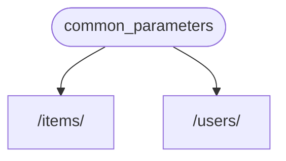
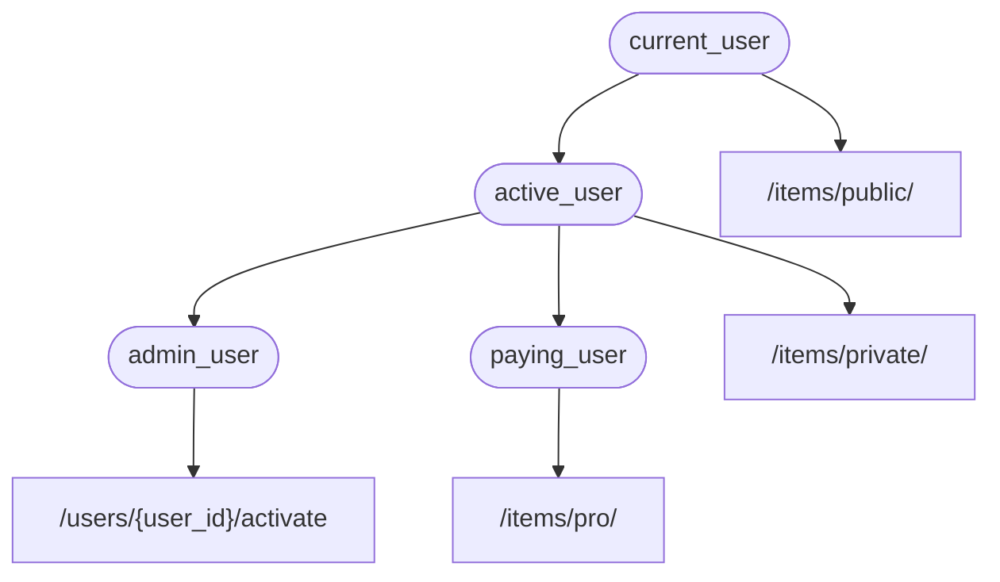

# وابستگی‌ها

**FastAPI** دارای یک سیستم **<abbr title="همچنین به نام‌های components، resources، providers، services، injectables شناخته می‌شود">تزریق وابستگی</abbr>** بسیار قدرتمند و در عین حال شهودی است.

این سیستم طراحی شده تا استفاده از آن بسیار ساده باشد و ادغام سایر اجزا با **FastAPI** را برای هر توسعه‌دهنده‌ای آسان کند.

## "تزریق وابستگی" چیست

**"تزریق وابستگی"** در برنامه‌نویسی به این معنی است که راهی برای کد شما (در این مورد، *توابع عملیات مسیر*) وجود دارد تا چیزهایی که برای کار کردن نیاز دارد را اعلام کند: "وابستگی‌ها".

و سپس، آن سیستم (در این مورد **FastAPI**) هر کاری که لازم باشد انجام می‌دهد تا آن وابستگی‌های مورد نیاز را به کد شما ارائه دهد ("تزریق" وابستگی‌ها).

این زمانی بسیار مفید است که نیاز دارید:

* منطق مشترک داشته باشید (همان منطق کد بارها و بارها).
* اتصالات پایگاه داده را به اشتراک بگذارید.
* امنیت، احراز هویت، نیازمندی‌های نقش و غیره را اعمال کنید.
* و خیلی چیزهای دیگر...

همه اینها، در حالی که تکرار کد را به حداقل می‌رساند.

## قدم‌های اول

بیایید یک مثال بسیار ساده ببینیم. به قدری ساده خواهد بود که فعلاً خیلی مفید نیست.

اما به این ترتیب می‌توانیم روی نحوه عملکرد سیستم **تزریق وابستگی** تمرکز کنیم.

### ایجاد یک وابستگی، یا "وابسته‌پذیر"

بیایید ابتدا روی وابستگی تمرکز کنیم.

این فقط یک تابع است که می‌تواند همان پارامترهایی را بگیرد که یک *تابع عملیات مسیر* می‌تواند بگیرد:

{* ../../docs_src/dependencies/tutorial001_an_py310.py hl[8:9] *}

همین.

**۲ خط**.

و همان شکل و ساختاری را دارد که تمام *توابع عملیات مسیر* شما دارند.

می‌توانید آن را مثل یک *تابع عملیات مسیر* بدون "دکوراتور" (بدون `@app.get("/some-path")`) در نظر بگیرید.

و می‌تواند هر چیزی که بخواهید برگرداند.

در این مورد، این وابستگی انتظار دارد:

* یک پارامتر پرس‌و‌جوی اختیاری `q` که یک `str` است.
* یک پارامتر پرس‌و‌جوی اختیاری `skip` که یک `int` است و به طور پیش‌فرض `0` است.
* یک پارامتر پرس‌و‌جوی اختیاری `limit` که یک `int` است و به طور پیش‌فرض `100` است.

و سپس فقط یک `dict` حاوی آن مقادیر را برمی‌گرداند.

/// info

FastAPI پشتیبانی از `Annotated` را در نسخه 0.95.0 اضافه کرد (و شروع به توصیه آن کرد).

اگر نسخه قدیمی‌تری دارید، هنگام تلاش برای استفاده از `Annotated` با خطا مواجه خواهید شد.

مطمئن شوید که [نسخه FastAPI را ارتقا دهید](../../deployment/versions.md#upgrading-the-fastapi-versions){.internal-link target=_blank} حداقل به 0.95.1 قبل از استفاده از `Annotated`.

///

### ایمپورت `Depends`

{* ../../docs_src/dependencies/tutorial001_an_py310.py hl[3] *}

### اعلام وابستگی، در "وابسته"

به همان روشی که از `Body`، `Query` و غیره با پارامترهای *تابع عملیات مسیر* استفاده می‌کنید، از `Depends` با یک پارامتر جدید استفاده کنید:

{* ../../docs_src/dependencies/tutorial001_an_py310.py hl[13,18] *}

اگرچه از `Depends` در پارامترهای تابع خود به همان روشی استفاده می‌کنید که از `Body`، `Query` و غیره استفاده می‌کنید، `Depends` کمی متفاوت عمل می‌کند.

شما فقط یک پارامتر واحد به `Depends` می‌دهید.

این پارامتر باید چیزی شبیه یک تابع باشد.

شما آن را مستقیماً **صدا نمی‌زنید** (پرانتز را در انتها اضافه نمی‌کنید)، فقط آن را به عنوان پارامتر به `Depends()` پاس می‌دهید.

و آن تابع پارامترها را به همان روشی می‌گیرد که *توابع عملیات مسیر* می‌گیرند.

/// tip

در فصل بعدی خواهید دید که چه "چیزهای" دیگری، علاوه بر توابع، می‌توانند به عنوان وابستگی استفاده شوند.

///

هر وقت یک درخواست جدید برسد، **FastAPI** مراقب خواهد بود:

* تابع وابستگی ("وابسته‌پذیر") شما را با پارامترهای صحیح صدا بزند.
* نتیجه را از تابع شما بگیرد.
* آن نتیجه را به پارامتر در *تابع عملیات مسیر* شما اختصاص دهد.



به این ترتیب کد مشترک را یک بار می‌نویسید و **FastAPI** مراقب صدا زدن آن برای *عملیات‌های مسیر* شما خواهد بود.

/// check

توجه کنید که نیازی نیست یک کلاس خاص بسازید و آن را جایی به **FastAPI** پاس دهید تا "ثبت" شود یا چیز مشابهی.

فقط آن را به `Depends` پاس می‌دهید و **FastAPI** می‌داند بقیه کارها را چگونه انجام دهد.

///

## اشتراک‌گذاری وابستگی‌های `Annotated`

در مثال‌های بالا، می‌بینید که مقداری **تکرار کد** وجود دارد.

وقتی نیاز دارید از وابستگی `common_parameters()` استفاده کنید، باید کل پارامتر را با حاشیه‌نویسی نوع و `Depends()` بنویسید:

```Python
commons: Annotated[dict, Depends(common_parameters)]
```

اما چون از `Annotated` استفاده می‌کنیم، می‌توانیم آن مقدار `Annotated` را در یک متغیر ذخیره کنیم و در چندین جا استفاده کنیم:

{* ../../docs_src/dependencies/tutorial001_02_an_py310.py hl[12,16,21] *}

/// tip

این فقط پایتون استاندارد است، به آن "نام مستعار نوع" می‌گویند، و در واقع خاص **FastAPI** نیست.

اما چون **FastAPI** بر اساس استانداردهای پایتون، از جمله `Annotated`، ساخته شده، می‌توانید از این ترفند در کد خود استفاده کنید. 😎

///

وابستگی‌ها همانطور که انتظار می‌رود به کار خود ادامه خواهند داد و **بهترین بخش** این است که **اطلاعات نوع حفظ می‌شود**، یعنی ویرایشگر شما همچنان قادر خواهد بود **تکمیل خودکار**، **خطاهای درون‌خطی** و غیره را ارائه دهد. همینطور برای ابزارهای دیگر مانند `mypy`.

این به ویژه زمانی مفید خواهد بود که از آن در یک **پایگاه کد بزرگ** استفاده کنید که در آن **همان وابستگی‌ها** را بارها و بارها در **بسیاری از *عملیات‌های مسیر*** استفاده می‌کنید.

## `async` یا غیر `async`

از آنجا که وابستگی‌ها نیز توسط **FastAPI** صدا زده می‌شوند (همانند *توابع عملیات مسیر* شما)، همان قوانین هنگام تعریف توابع شما اعمال می‌شود.

می‌توانید از `async def` یا `def` معمولی استفاده کنید.

و می‌توانید وابستگی‌ها را با `async def` در داخل *توابع عملیات مسیر* معمولی `def` اعلام کنید، یا وابستگی‌های `def` را در داخل *توابع عملیات مسیر* `async def` و غیره.

فرقی نمی‌کند. **FastAPI** می‌داند چه کاری انجام دهد.

/// note

اگر نمی‌دانید، بخش [Async: *"عجله دارید؟"*](../../async.md#in-a-hurry){.internal-link target=_blank} درباره `async` و `await` در مستندات را بررسی کنید.

///

## ادغام با OpenAPI

تمام اعلامیه‌های درخواست، اعتبارسنجی‌ها و نیازمندی‌های وابستگی‌ها (و زیروابستگی‌ها) شما در همان اسکیمای OpenAPI ادغام خواهند شد.

بنابراین، مستندات تعاملی تمام اطلاعات از این وابستگی‌ها را نیز خواهند داشت:


## استفاده ساده

اگر به آن نگاه کنید، *توابع عملیات مسیر* اعلام می‌شوند تا هر وقت یک *مسیر* و *عملیات* مطابقت داشت استفاده شوند، و سپس **FastAPI** مراقب صدا زدن تابع با پارامترهای صحیح، استخراج داده از درخواست خواهد بود.

در واقع، تمام (یا اکثر) فریم‌ورک‌های وب به همین شکل کار می‌کنند.

شما هرگز آن توابع را مستقیماً صدا نمی‌زنید. آنها توسط فریم‌ورک شما (در این مورد، **FastAPI**) صدا زده می‌شوند.

با سیستم تزریق وابستگی، همچنین می‌توانید به **FastAPI** بگویید که *تابع عملیات مسیر* شما نیز به چیز دیگری "وابسته" است که باید قبل از *تابع عملیات مسیر* شما اجرا شود، و **FastAPI** مراقب اجرای آن و "تزریق" نتایج خواهد بود.

سایر اصطلاحات رایج برای همین ایده "تزریق وابستگی" عبارتند از:

* resources
* providers
* services
* injectables
* components

## پلاگین‌های **FastAPI**

ادغام‌ها و "پلاگین‌ها" را می‌توان با استفاده از سیستم **تزریق وابستگی** ساخت. اما در واقع، واقعاً **نیازی به ایجاد "پلاگین" نیست**، زیرا با استفاده از وابستگی‌ها، امکان اعلام تعداد نامحدودی از ادغام‌ها و تعاملات وجود دارد که برای *توابع عملیات مسیر* شما در دسترس قرار می‌گیرند.

و وابستگی‌ها را می‌توان به روشی بسیار ساده و شهودی ایجاد کرد که به شما اجازه می‌دهد فقط بسته‌های پایتون مورد نیاز خود را ایمپورت کنید و آنها را با توابع API خود در چند خط کد ادغام کنید، *به معنای واقعی کلمه*.

نمونه‌هایی از این را در فصل‌های بعدی، درباره پایگاه‌های داده رابطه‌ای و NoSQL، امنیت و غیره خواهید دید.

## سازگاری **FastAPI**

سادگی سیستم تزریق وابستگی **FastAPI** را با موارد زیر سازگار می‌کند:

* تمام پایگاه‌های داده رابطه‌ای
* پایگاه‌های داده NoSQL
* بسته‌های خارجی
* API‌های خارجی
* سیستم‌های احراز هویت و مجوزدهی
* سیستم‌های نظارت بر استفاده از API
* سیستم‌های تزریق داده پاسخ
* و غیره.

## ساده و قدرتمند

اگرچه سیستم تزریق وابستگی سلسله‌مراتبی برای تعریف و استفاده بسیار ساده است، اما همچنان بسیار قدرتمند است.

می‌توانید وابستگی‌هایی تعریف کنید که خودشان نیز وابستگی‌هایی تعریف کنند.

در نهایت، یک درخت سلسله‌مراتبی از وابستگی‌ها ساخته می‌شود و سیستم **تزریق وابستگی** مراقب حل تمام این وابستگی‌ها برای شما (و زیروابستگی‌های آنها) و ارائه (تزریق) نتایج در هر مرحله خواهد بود.

به عنوان مثال، فرض کنید ۴ نقطه پایانی API (*عملیات‌های مسیر*) دارید:

* `/items/public/`
* `/items/private/`
* `/users/{user_id}/activate`
* `/items/pro/`

سپس می‌توانید نیازمندی‌های مجوز مختلفی برای هر کدام فقط با وابستگی‌ها و زیروابستگی‌ها اضافه کنید:



## ادغام با **OpenAPI**

تمام این وابستگی‌ها، در حالی که نیازمندی‌های خود را اعلام می‌کنند، پارامترها، اعتبارسنجی‌ها و غیره را نیز به *عملیات‌های مسیر* شما اضافه می‌کنند.

**FastAPI** مراقب اضافه کردن همه اینها به اسکیمای OpenAPI خواهد بود تا در سیستم‌های مستندات تعاملی نمایش داده شوند.
