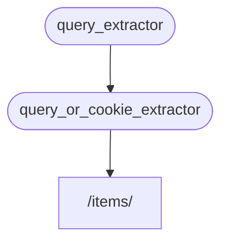

# زیروابستگی‌ها

می‌توانید وابستگی‌هایی ایجاد کنید که **زیروابستگی** دارند.

آنها می‌توانند به هر **عمقی** که نیاز دارید باشند.

**FastAPI** مراقب حل آنها خواهد بود.

## اولین وابستگی "وابسته‌پذیر"

می‌توانید یک اولین وابستگی ("وابسته‌پذیر") مانند زیر ایجاد کنید:

{* ../../docs_src/dependencies/tutorial005_an_py310.py hl[8:9] *}

یک پارامتر پرس‌و‌جوی اختیاری `q` به عنوان `str` اعلام می‌کند و سپس فقط آن را برمی‌گرداند.

این کاملاً ساده است (خیلی مفید نیست)، اما به ما کمک می‌کند روی نحوه عملکرد زیروابستگی‌ها تمرکز کنیم.

## دومین وابستگی، "وابسته‌پذیر" و "وابسته"

سپس می‌توانید یک تابع وابستگی دیگر ("وابسته‌پذیر") ایجاد کنید که در عین حال وابستگی خودش را نیز اعلام می‌کند (بنابراین یک "وابسته" نیز هست):

{* ../../docs_src/dependencies/tutorial005_an_py310.py hl[13] *}

بیایید روی پارامترهای اعلام‌شده تمرکز کنیم:

* حتی اگر این تابع خودش یک وابستگی ("وابسته‌پذیر") باشد، همچنین وابستگی دیگری را اعلام می‌کند (به چیز دیگری "وابسته" است).
    * به `query_extractor` وابسته است و مقدار بازگشتی آن را به پارامتر `q` اختصاص می‌دهد.
* همچنین یک کوکی اختیاری `last_query` به عنوان `str` اعلام می‌کند.
    * اگر کاربر هیچ پرس‌و‌جوی `q` ارائه نداد، از آخرین پرس‌و‌جوی استفاده‌شده که قبلاً در یک کوکی ذخیره کرده بودیم استفاده می‌کنیم.

## استفاده از وابستگی

سپس می‌توانیم از وابستگی استفاده کنیم:

{* ../../docs_src/dependencies/tutorial005_an_py310.py hl[23] *}

/// info

توجه کنید که ما فقط یک وابستگی را در *تابع عملیات مسیر* اعلام می‌کنیم، یعنی `query_or_cookie_extractor`.

اما **FastAPI** می‌داند که ابتدا باید `query_extractor` را حل کند تا نتایج آن را هنگام صدا زدن به `query_or_cookie_extractor` پاس دهد.

///



## استفاده از یک وابستگی چندین بار

اگر یکی از وابستگی‌های شما چندین بار برای همان *عملیات مسیر* اعلام شود، مثلاً چندین وابستگی یک زیروابستگی مشترک داشته باشند، **FastAPI** می‌داند که آن زیروابستگی را فقط یک بار در هر درخواست صدا بزند.

و مقدار بازگشتی را در یک <abbr title="یک ابزار/سیستم برای ذخیره مقادیر محاسبه‌شده/تولیدشده، برای استفاده مجدد به جای محاسبه دوباره آنها.">"حافظه پنهان"</abbr> ذخیره می‌کند و آن را به تمام "وابسته‌ها"یی که در آن درخواست خاص به آن نیاز دارند پاس می‌دهد، به جای صدا زدن چندباره وابستگی برای همان درخواست.

در یک سناریوی پیشرفته که می‌دانید نیاز دارید وابستگی در هر مرحله (احتمالاً چندین بار) در همان درخواست صدا زده شود به جای استفاده از مقدار "حافظه پنهان"، می‌توانید پارامتر `use_cache=False` را هنگام استفاده از `Depends` تنظیم کنید:

//// tab | Python 3.8+

```Python hl_lines="1"
async def needy_dependency(fresh_value: Annotated[str, Depends(get_value, use_cache=False)]):
    return {"fresh_value": fresh_value}
```

////

//// tab | Python 3.8+ non-Annotated

/// tip

| ترجیحاً از نسخه `Annotated` استفاده کنید اگر امکان‌پذیر است.

///

```Python hl_lines="1"
async def needy_dependency(fresh_value: str = Depends(get_value, use_cache=False)):
    return {"fresh_value": fresh_value}
```

////

## جمع‌بندی

جدا از تمام کلمات فانتزی استفاده‌شده اینجا، سیستم **تزریق وابستگی** کاملاً ساده است.

فقط توابعی که شبیه *توابع عملیات مسیر* به نظر می‌رسند.

اما با این حال، بسیار قدرتمند است و به شما اجازه می‌دهد "گراف‌های" (درخت‌های) وابستگی با عمق دلخواه و تودرتو اعلام کنید.

/// tip

همه اینها ممکن است با این مثال‌های ساده خیلی مفید به نظر نرسد.

اما خواهید دید که در فصل‌های مربوط به **امنیت** چقدر مفید است.

و همچنین خواهید دید که چه مقدار کد برای شما صرفه‌جویی می‌کند.

///
