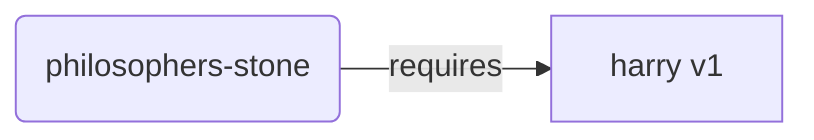
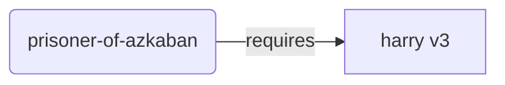
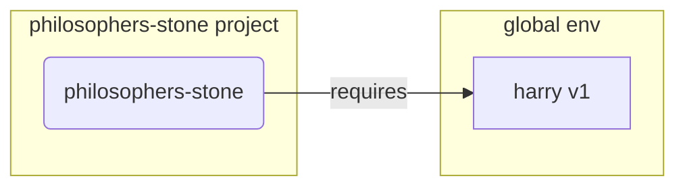
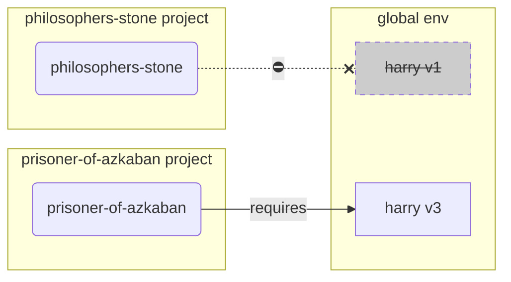
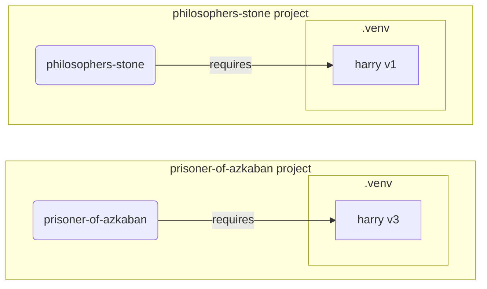

# محیط‌های مجازی

وقتی روی پروژه‌های پایتون کار می‌کنید، احتمالاً باید از یک **محیط مجازی** (یا مکانیزم مشابه) برای جداسازی پکیج‌هایی که برای هر پروژه نصب می‌کنید استفاده کنید.

/// info

اگر از قبل درباره محیط‌های مجازی می‌دانید، نحوه ایجاد و استفاده از آنها را بلد هستید، ممکن است بخواهید از این بخش رد شوید. 🤓

///

/// tip

یک **محیط مجازی** با یک **متغیر محیطی** متفاوت است.

یک **متغیر محیطی** یک متغیر در سیستم است که می‌تواند توسط برنامه‌ها استفاده شود.

یک **محیط مجازی** یک دایرکتوری با برخی فایل‌ها در آن است.

///

/// info

این صفحه نحوه استفاده از **محیط‌های مجازی** و نحوه کار آنها را به شما آموزش خواهد داد.

اگر آماده‌اید ابزاری که **همه چیز را مدیریت می‌کند** (از جمله نصب پایتون) را بپذیرید، <a href="https://github.com/astral-sh/uv" class="external-link" target="_blank">uv</a> را امتحان کنید.

///

## ایجاد یک پروژه

ابتدا، یک دایرکتوری برای پروژه‌تان ایجاد کنید.

آنچه معمولاً انجام می‌دهم ایجاد یک دایرکتوری به نام `code` درون دایرکتوری home/user است.

و درون آن یک دایرکتوری برای هر پروژه ایجاد می‌کنم.

<div class="termy">

```console
// Go to the home directory
$ cd
// Create a directory for all your code projects
$ mkdir code
// Enter into that code directory
$ cd code
// Create a directory for this project
$ mkdir awesome-project
// Enter into that project directory
$ cd awesome-project
```

</div>

## ایجاد یک محیط مجازی

وقتی شروع به کار روی یک پروژه پایتون **برای اولین بار** می‌کنید، یک محیط مجازی **<abbr title="گزینه‌های دیگری هم وجود دارد، این یک راهنمای ساده است">درون پروژه‌تان</abbr>** ایجاد کنید.

/// tip

فقط باید این کار را **یک بار برای هر پروژه** انجام دهید، نه هر بار که کار می‌کنید.

///

//// tab | `venv`

برای ایجاد یک محیط مجازی، می‌توانید از ماژول `venv` که همراه پایتون ارائه می‌شود استفاده کنید.

<div class="termy">

```console
$ python -m venv .venv
```

</div>

/// details | معنی آن دستور

* `python`: از برنامه‌ای به نام `python` استفاده کنید
* `-m`: یک ماژول را به عنوان اسکریپت فراخوانی کنید، در ادامه ماژول را مشخص خواهیم کرد
* `venv`: از ماژولی به نام `venv` استفاده کنید که معمولاً همراه پایتون نصب می‌شود
* `.venv`: محیط مجازی را در دایرکتوری جدید `.venv` ایجاد کنید

///

////

//// tab | `uv`

اگر <a href="https://github.com/astral-sh/uv" class="external-link" target="_blank">`uv`</a> نصب دارید، می‌توانید از آن برای ایجاد یک محیط مجازی استفاده کنید.

<div class="termy">

```console
$ uv venv
```

</div>

/// tip

به طور پیش‌فرض، `uv` محیط مجازی را در دایرکتوری‌ای به نام `.venv` ایجاد خواهد کرد.

اما می‌توانید آن را با ارسال یک آرگومان اضافی با نام دایرکتوری سفارشی کنید.

///

////

آن دستور یک محیط مجازی جدید در دایرکتوری‌ای به نام `.venv` ایجاد می‌کند.

/// details | `.venv` یا نام دیگر

می‌توانید محیط مجازی را در دایرکتوری دیگری ایجاد کنید، اما یک قرارداد وجود دارد که آن را `.venv` بنامید.

///

## فعال‌سازی محیط مجازی

محیط مجازی جدید را فعال کنید تا هر دستور پایتون یا پکیجی که نصب می‌کنید از آن استفاده کند.

/// tip

این کار را **هر بار** که یک **جلسه ترمینال جدید** برای کار روی پروژه شروع می‌کنید انجام دهید.

///

//// tab | Linux, macOS

<div class="termy">

```console
$ source .venv/bin/activate
```

</div>

////

//// tab | Windows PowerShell

<div class="termy">

```console
$ .venv\Scripts\Activate.ps1
```

</div>

////

//// tab | Windows Bash

یا اگر از Bash برای ویندوز استفاده می‌کنید (مثلاً <a href="https://gitforwindows.org/" class="external-link" target="_blank">Git Bash</a>):

<div class="termy">

```console
$ source .venv/Scripts/activate
```

</div>

////

/// tip

هر بار که یک **پکیج جدید** در آن محیط نصب می‌کنید، محیط را دوباره **فعال** کنید.

این اطمینان می‌دهد که اگر از یک **برنامه ترمینال (<abbr title="command line interface">CLI</abbr>)** نصب‌شده توسط آن پکیج استفاده کنید، از نسخه محیط مجازی خود استفاده می‌کنید و نه نسخه دیگری که ممکن است به صورت سراسری نصب شده باشد، احتمالاً با نسخه متفاوتی از آنچه نیاز دارید.

///

## بررسی فعال بودن محیط مجازی

بررسی کنید که محیط مجازی فعال است (دستور قبلی کار کرده است).

/// tip

این **اختیاری** است، اما راه خوبی برای **بررسی** اینکه همه چیز همانطور که انتظار می‌رود کار می‌کند و از محیط مجازی مورد نظرتان استفاده می‌کنید.

///

//// tab | Linux, macOS, Windows Bash

<div class="termy">

```console
$ which python

/home/user/code/awesome-project/.venv/bin/python
```

</div>

اگر باینری `python` را در `.venv/bin/python` نشان دهد، درون پروژه شما (در اینجا `awesome-project`)، کار کرده است. 🎉

////

//// tab | Windows PowerShell

<div class="termy">

```console
$ Get-Command python

C:\Users\user\code\awesome-project\.venv\Scripts\python
```

</div>

اگر باینری `python` را در `.venv\Scripts\python` نشان دهد، درون پروژه شما (در اینجا `awesome-project`)، کار کرده است. 🎉

////

## ارتقاء `pip`

/// tip

اگر از <a href="https://github.com/astral-sh/uv" class="external-link" target="_blank">`uv`</a> استفاده می‌کنید، از آن برای نصب چیزها به جای `pip` استفاده خواهید کرد، بنابراین نیازی به ارتقاء `pip` ندارید. 😎

///

اگر از `pip` برای نصب پکیج‌ها استفاده می‌کنید (به طور پیش‌فرض همراه پایتون ارائه می‌شود)، باید آن را به آخرین نسخه **ارتقاء** دهید.

بسیاری از خطاهای عجیب هنگام نصب پکیج با ارتقاء `pip` ابتدا حل می‌شوند.

/// tip

معمولاً این کار را **یک بار** انجام می‌دهید، درست بعد از ایجاد محیط مجازی.

///

مطمئن شوید محیط مجازی فعال است (با دستور بالا) و سپس اجرا کنید:

<div class="termy">

```console
$ python -m pip install --upgrade pip

---> 100%
```

</div>

## افزودن `.gitignore`

اگر از **Git** استفاده می‌کنید (که باید)، یک فایل `.gitignore` اضافه کنید تا همه چیز در `.venv` از Git خارج شود.

/// tip

اگر از <a href="https://github.com/astral-sh/uv" class="external-link" target="_blank">`uv`</a> برای ایجاد محیط مجازی استفاده کردید، قبلاً این کار را برایتان انجام داده، می‌توانید از این مرحله رد شوید. 😎

///

/// tip

این کار را **یک بار** انجام دهید، درست بعد از ایجاد محیط مجازی.

///

<div class="termy">

```console
$ echo "*" > .venv/.gitignore
```

</div>

/// details | معنی آن دستور

* `echo "*"`: متن `*` را در ترمینال "چاپ" خواهد کرد (بخش بعدی آن را کمی تغییر می‌دهد)
* `>`: هر چیزی که توسط دستور سمت چپ `>` در ترمینال چاپ شود نباید چاپ شود بلکه در عوض در فایلی که سمت راست `>` قرار دارد نوشته شود
* `.gitignore`: نام فایلی که متن باید در آن نوشته شود

و `*` برای Git به معنی "همه چیز" است. بنابراین، همه چیز در دایرکتوری `.venv` را نادیده خواهد گرفت.

آن دستور فایل `.gitignore` با محتوای زیر ایجاد خواهد کرد:

```gitignore
*
```

///

## نصب پکیج‌ها

بعد از فعال‌سازی محیط، می‌توانید پکیج‌ها را در آن نصب کنید.

/// tip

این کار را **یک بار** هنگام نصب یا ارتقاء پکیج‌های مورد نیاز پروژه‌تان انجام دهید.

اگر نیاز به ارتقاء نسخه یا افزودن پکیج جدید دارید، **دوباره این کار را انجام می‌دهید**.

///

### نصب مستقیم پکیج‌ها

اگر عجله دارید و نمی‌خواهید از فایلی برای اعلان نیازمندی‌های پکیج پروژه‌تان استفاده کنید، می‌توانید آنها را مستقیماً نصب کنید.

/// tip

قرار دادن پکیج‌ها و نسخه‌های مورد نیاز برنامه‌تان در یک فایل (مثلاً `requirements.txt` یا `pyproject.toml`) ایده (بسیار) خوبی است.

///

//// tab | `pip`

<div class="termy">

```console
$ pip install "fastapi[standard]"

---> 100%
```

</div>

////

//// tab | `uv`

اگر <a href="https://github.com/astral-sh/uv" class="external-link" target="_blank">`uv`</a> دارید:

<div class="termy">

```console
$ uv pip install "fastapi[standard]"
---> 100%
```

</div>

////

### نصب از `requirements.txt`

اگر یک `requirements.txt` دارید، اکنون می‌توانید از آن برای نصب پکیج‌هایش استفاده کنید.

//// tab | `pip`

<div class="termy">

```console
$ pip install -r requirements.txt
---> 100%
```

</div>

////

//// tab | `uv`

اگر <a href="https://github.com/astral-sh/uv" class="external-link" target="_blank">`uv`</a> دارید:

<div class="termy">

```console
$ uv pip install -r requirements.txt
---> 100%
```

</div>

////

/// details | `requirements.txt`

یک `requirements.txt` با برخی پکیج‌ها می‌تواند مانند زیر باشد:

```requirements.txt
fastapi[standard]==0.113.0
pydantic==2.8.0
```

///

## اجرای برنامه‌تان

بعد از فعال‌سازی محیط مجازی، می‌توانید برنامه‌تان را اجرا کنید و از پایتون درون محیط مجازی با پکیج‌هایی که آنجا نصب کردید استفاده خواهد کرد.

<div class="termy">

```console
$ python main.py

Hello World
```

</div>

## پیکربندی ویرایشگر

احتمالاً از یک ویرایشگر استفاده خواهید کرد، مطمئن شوید آن را برای استفاده از همان محیط مجازی که ایجاد کردید پیکربندی کنید (احتمالاً خودش آن را شناسایی خواهد کرد) تا بتوانید تکمیل خودکار و خطاهای درون‌خطی دریافت کنید.

به عنوان مثال:

* <a href="https://code.visualstudio.com/docs/python/environments#_select-and-activate-an-environment" class="external-link" target="_blank">VS Code</a>
* <a href="https://www.jetbrains.com/help/pycharm/creating-virtual-environment.html" class="external-link" target="_blank">PyCharm</a>

/// tip

معمولاً فقط باید این کار را **یک بار** انجام دهید، وقتی محیط مجازی را ایجاد می‌کنید.

///

## غیرفعال‌سازی محیط مجازی

وقتی کار با پروژه‌تان تمام شد، می‌توانید محیط مجازی را **غیرفعال** کنید.

<div class="termy">

```console
$ deactivate
```

</div>

به این ترتیب، وقتی `python` را اجرا کنید، سعی نخواهد کرد آن را از آن محیط مجازی با پکیج‌های نصب‌شده آنجا اجرا کند.

## آماده برای کار

اکنون آماده شروع کار روی پروژه‌تان هستید.


/// tip

آیا می‌خواهید بفهمید همه آنچه بالا بود چیست؟

ادامه بخوانید. 👇🤓

///

## چرا محیط‌های مجازی

برای کار با FastAPI باید <a href="https://www.python.org/" class="external-link" target="_blank">پایتون</a> را نصب کنید.

بعد از آن، باید FastAPI و هر **پکیج** دیگری که می‌خواهید استفاده کنید را **نصب** کنید.

برای نصب پکیج‌ها معمولاً از دستور `pip` که همراه پایتون ارائه می‌شود (یا جایگزین‌های مشابه) استفاده می‌کنید.

با این حال، اگر فقط `pip` را مستقیماً استفاده کنید، پکیج‌ها در **محیط پایتون سراسری** شما (نصب سراسری پایتون) نصب خواهند شد.

### مشکل

بنابراین، مشکل نصب پکیج‌ها در محیط پایتون سراسری چیست؟

در نقطه‌ای، احتمالاً برنامه‌های مختلف زیادی خواهید نوشت که به **پکیج‌های مختلف** وابسته هستند. و برخی از این پروژه‌ها به **نسخه‌های مختلف** همان پکیج وابسته خواهند بود. 😱

به عنوان مثال، می‌توانید پروژه‌ای به نام `philosophers-stone` ایجاد کنید، این برنامه به پکیج دیگری به نام **`harry` با استفاده از نسخه `1`** وابسته است. بنابراین باید `harry` را نصب کنید.



سپس، در نقطه‌ای بعداً، پروژه دیگری به نام `prisoner-of-azkaban` ایجاد می‌کنید و این پروژه نیز به `harry` وابسته است، اما به **نسخه `3` `harry`** نیاز دارد.



اما حالا مشکل این است که اگر پکیج‌ها را به صورت سراسری (در محیط سراسری) به جای یک **محیط مجازی** محلی نصب کنید، باید انتخاب کنید کدام نسخه `harry` را نصب کنید.

اگر می‌خواهید `philosophers-stone` را اجرا کنید، ابتدا باید نسخه `1` `harry` را نصب کنید، به عنوان مثال با:

<div class="termy">

```console
$ pip install "harry==1"
```

</div>

و سپس نسخه `1` `harry` در محیط پایتون سراسری شما نصب خواهد شد.



اما اگر می‌خواهید `prisoner-of-azkaban` را اجرا کنید، باید نسخه `1` `harry` را حذف و نسخه `3` `harry` را نصب کنید (یا فقط نصب نسخه `3` به طور خودکار نسخه `1` را حذف خواهد کرد).

<div class="termy">

```console
$ pip install "harry==3"
```

</div>

و سپس نسخه `3` `harry` در محیط پایتون سراسری شما نصب خواهد شد.

و اگر سعی کنید `philosophers-stone` را دوباره اجرا کنید، احتمالاً **کار نخواهد کرد** زیرا به نسخه `1` `harry` نیاز دارد.



/// tip

در پکیج‌های پایتون بسیار رایج است که تلاش کنند از **تغییرات شکننده** در **نسخه‌های جدید** اجتناب کنند، اما بهتر است احتیاط کنید و نسخه‌های جدیدتر را عمداً و وقتی می‌توانید تست‌ها را اجرا کنید تا مطمئن شوید همه چیز درست کار می‌کند نصب کنید.

///

حالا تصور کنید این با **بسیاری** از **پکیج‌های** دیگری که همه **پروژه‌هایتان** به آنها وابسته هستند. مدیریت آن بسیار دشوار است. و احتمالاً برخی پروژه‌ها را با **نسخه‌های ناسازگار** پکیج‌ها اجرا خواهید کرد و نمی‌دانید چرا چیزی کار نمی‌کند.

همچنین، بسته به سیستم عامل شما (مثلاً Linux، Windows، macOS)، ممکن است پایتون از قبل نصب شده باشد. و در آن صورت احتمالاً برخی پکیج‌ها با نسخه‌های خاصی **مورد نیاز سیستم** از پیش نصب شده‌اند. اگر پکیج‌ها را در محیط پایتون سراسری نصب کنید، ممکن است برخی از برنامه‌هایی که همراه سیستم عامل آمده‌اند را **خراب** کنید.

## پکیج‌ها کجا نصب می‌شوند

وقتی پایتون را نصب می‌کنید، برخی دایرکتوری‌ها با برخی فایل‌ها در کامپیوترتان ایجاد می‌شود.

برخی از این دایرکتوری‌ها مسئول داشتن تمام پکیج‌هایی هستند که نصب می‌کنید.

وقتی اجرا می‌کنید:

<div class="termy">

```console
// Don't run this now, it's just an example 🤓
$ pip install "fastapi[standard]"
---> 100%
```

</div>

یک فایل فشرده با کد FastAPI را دانلود خواهد کرد، معمولاً از <a href="https://pypi.org/project/fastapi/" class="external-link" target="_blank">PyPI</a>.

همچنین فایل‌هایی را برای پکیج‌های دیگری که FastAPI به آنها وابسته است **دانلود** خواهد کرد.

سپس تمام آن فایل‌ها را **استخراج** و در دایرکتوری‌ای در کامپیوترتان قرار خواهد داد.

به طور پیش‌فرض، آن فایل‌های دانلود و استخراج شده را در دایرکتوری‌ای که همراه نصب پایتون شما ارائه می‌شود قرار خواهد داد، یعنی **محیط سراسری**.

## محیط‌های مجازی چیست

راه‌حل مشکلات داشتن همه پکیج‌ها در محیط سراسری، استفاده از یک **محیط مجازی برای هر پروژه‌ای** است که روی آن کار می‌کنید.

یک محیط مجازی یک **دایرکتوری** است، بسیار مشابه دایرکتوری سراسری، که می‌توانید پکیج‌های یک پروژه را در آن نصب کنید.

به این ترتیب، هر پروژه محیط مجازی خود (دایرکتوری `.venv`) با پکیج‌های خودش را خواهد داشت.



## فعال‌سازی محیط مجازی به چه معناست

وقتی یک محیط مجازی را فعال می‌کنید، به عنوان مثال با:

//// tab | Linux, macOS

<div class="termy">

```console
$ source .venv/bin/activate
```

</div>

////

//// tab | Windows PowerShell

<div class="termy">

```console
$ .venv\Scripts\Activate.ps1
```

</div>

////

//// tab | Windows Bash

یا اگر از Bash برای ویندوز استفاده می‌کنید (مثلاً <a href="https://gitforwindows.org/" class="external-link" target="_blank">Git Bash</a>):

<div class="termy">

```console
$ source .venv/Scripts/activate
```

</div>

////

آن دستور برخی [متغیرهای محیطی](environment-variables.md){.internal-link target=_blank} را ایجاد یا تغییر خواهد داد که برای دستورات بعدی در دسترس خواهند بود.

یکی از آن متغیرها متغیر `PATH` است.

/// tip

می‌توانید بیشتر درباره متغیر محیطی `PATH` در بخش [متغیرهای محیطی](environment-variables.md#path-environment-variable){.internal-link target=_blank} بیاموزید.

///

فعال‌سازی محیط مجازی مسیر `.venv/bin` (در Linux و macOS) یا `.venv\Scripts` (در Windows) را به متغیر محیطی `PATH` اضافه می‌کند.

فرض کنید قبل از فعال‌سازی محیط، متغیر `PATH` مانند زیر بود:

//// tab | Linux, macOS

```plaintext
/usr/bin:/bin:/usr/sbin:/sbin
```

یعنی سیستم برنامه‌ها را در دایرکتوری‌های زیر جستجو خواهد کرد:

* `/usr/bin`
* `/bin`
* `/usr/sbin`
* `/sbin`

////

//// tab | Windows

```plaintext
C:\Windows\System32
```

یعنی سیستم برنامه‌ها را در دایرکتوری‌های زیر جستجو خواهد کرد:

* `C:\Windows\System32`

////

بعد از فعال‌سازی محیط مجازی، متغیر `PATH` چیزی شبیه زیر خواهد بود:

//// tab | Linux, macOS

```plaintext
/home/user/code/awesome-project/.venv/bin:/usr/bin:/bin:/usr/sbin:/sbin
```

یعنی سیستم اکنون ابتدا برنامه‌ها را جستجو خواهد کرد در:

```plaintext
/home/user/code/awesome-project/.venv/bin
```

قبل از جستجو در دایرکتوری‌های دیگر.

بنابراین، وقتی `python` را در ترمینال تایپ می‌کنید، سیستم برنامه پایتون را در

```plaintext
/home/user/code/awesome-project/.venv/bin/python
```

پیدا و از آن استفاده خواهد کرد.

////

//// tab | Windows

```plaintext
C:\Users\user\code\awesome-project\.venv\Scripts;C:\Windows\System32
```

یعنی سیستم اکنون ابتدا برنامه‌ها را جستجو خواهد کرد در:

```plaintext
C:\Users\user\code\awesome-project\.venv\Scripts
```

قبل از جستجو در دایرکتوری‌های دیگر.

بنابراین، وقتی `python` را در ترمینال تایپ می‌کنید، سیستم برنامه پایتون را در

```plaintext
C:\Users\user\code\awesome-project\.venv\Scripts\python
```

پیدا و از آن استفاده خواهد کرد.

////

یک جزئیات مهم این است که مسیر محیط مجازی را در **ابتدای** متغیر `PATH` قرار می‌دهد. سیستم آن را **قبل** از یافتن هر پایتون دیگر موجود پیدا خواهد کرد. به این ترتیب، وقتی `python` را اجرا می‌کنید، از پایتون **محیط مجازی** به جای هر `python` دیگری (به عنوان مثال، `python` از محیط سراسری) استفاده خواهد کرد.

فعال‌سازی محیط مجازی چند چیز دیگر نیز تغییر می‌دهد، اما این یکی از مهم‌ترین کارهایی است که انجام می‌دهد.

## بررسی محیط مجازی

وقتی بررسی می‌کنید آیا محیط مجازی فعال است، به عنوان مثال با:

//// tab | Linux, macOS, Windows Bash

<div class="termy">

```console
$ which python

/home/user/code/awesome-project/.venv/bin/python
```

</div>

////

//// tab | Windows PowerShell

<div class="termy">

```console
$ Get-Command python

C:\Users\user\code\awesome-project\.venv\Scripts\python
```

</div>

////

یعنی برنامه `python` که استفاده خواهد شد، برنامه‌ای **در محیط مجازی** است.

در Linux و macOS از `which` و در Windows PowerShell از `Get-Command` استفاده می‌کنید.

نحوه کار آن دستور این است که متغیر محیطی `PATH` را بررسی می‌کند و از **هر مسیر به ترتیب** عبور می‌کند و به دنبال برنامه‌ای به نام `python` می‌گردد. وقتی آن را پیدا کند، **مسیر** آن برنامه را نشان خواهد داد.

مهم‌ترین بخش این است که وقتی `python` را فراخوانی می‌کنید، دقیقاً همان "`python`" اجرا خواهد شد.

بنابراین، می‌توانید تأیید کنید آیا در محیط مجازی درست هستید.

/// tip

فعال‌سازی یک محیط مجازی، گرفتن یک پایتون و سپس **رفتن به پروژه دیگر** آسان است.

و پروژه دوم **کار نخواهد کرد** زیرا از **پایتون اشتباه** از محیط مجازی پروژه دیگر استفاده می‌کنید.

توانایی بررسی اینکه از چه `python` استفاده می‌شود مفید است. 🤓

///

## چرا غیرفعال‌سازی محیط مجازی

به عنوان مثال، ممکن است روی پروژه `philosophers-stone` کار کنید، **آن محیط مجازی را فعال** کنید، پکیج‌ها را نصب و با آن محیط کار کنید.

و سپس می‌خواهید روی **پروژه دیگری** `prisoner-of-azkaban` کار کنید.

به آن پروژه می‌روید:

<div class="termy">

```console
$ cd ~/code/prisoner-of-azkaban
```

</div>

اگر محیط مجازی `philosophers-stone` را غیرفعال نکنید، وقتی `python` را در ترمینال اجرا کنید، سعی خواهد کرد از پایتون `philosophers-stone` استفاده کند.

<div class="termy">

```console
$ cd ~/code/prisoner-of-azkaban

$ python main.py

// Error importing sirius, it's not installed 😱
Traceback (most recent call last):
    File "main.py", line 1, in <module>
        import sirius
```

</div>

اما اگر محیط مجازی را غیرفعال و محیط جدید `prisoner-of-azkaban` را فعال کنید، وقتی `python` را اجرا کنید از پایتون محیط مجازی `prisoner-of-azkaban` استفاده خواهد کرد.

<div class="termy">

```console
$ cd ~/code/prisoner-of-azkaban

// You don't need to be in the old directory to deactivate, you can do it wherever you are, even after going to the other project 😎
$ deactivate

// Activate the virtual environment in prisoner-of-azkaban/.venv 🚀
$ source .venv/bin/activate

// Now when you run python, it will find the package sirius installed in this virtual environment ✨
$ python main.py

I solemnly swear 🐺
```

</div>

## جایگزین‌ها

این یک راهنمای ساده برای شروع و آموزش نحوه کار همه چیز **در زیرساخت** است.

**جایگزین‌های** بسیاری برای مدیریت محیط‌های مجازی، وابستگی‌های پکیج (نیازمندی‌ها) و پروژه‌ها وجود دارد.

وقتی آماده شدید و می‌خواهید ابزاری برای **مدیریت کل پروژه**، وابستگی‌های پکیج، محیط‌های مجازی و غیره استفاده کنید، پیشنهاد می‌کنم <a href="https://github.com/astral-sh/uv" class="external-link" target="_blank">uv</a> را امتحان کنید.

`uv` می‌تواند کارهای زیادی انجام دهد:

* **نصب پایتون** برای شما، از جمله نسخه‌های مختلف
* مدیریت **محیط مجازی** برای پروژه‌هایتان
* نصب **پکیج‌ها**
* مدیریت **وابستگی‌ها و نسخه‌های** پکیج برای پروژه‌تان
* اطمینان از اینکه مجموعه **دقیقی** از پکیج‌ها و نسخه‌ها برای نصب دارید، شامل وابستگی‌هایشان، تا بتوانید مطمئن شوید پروژه‌تان را در محیط تولید دقیقاً مانند کامپیوترتان هنگام توسعه اجرا کنید، این **قفل‌سازی** نامیده می‌شود
* و بسیاری چیزهای دیگر

## نتیجه‌گیری

اگر همه اینها را خواندید و درک کردید، اکنون **بسیار بیشتر** از بسیاری از توسعه‌دهندگان درباره محیط‌های مجازی می‌دانید. 🤓

دانستن این جزئیات احتمالاً در زمان آینده مفید خواهد بود وقتی چیزی را اشکال‌زدایی می‌کنید که پیچیده به نظر می‌رسد، اما می‌دانید **همه چیز در زیرساخت چگونه کار می‌کند**. 😎
