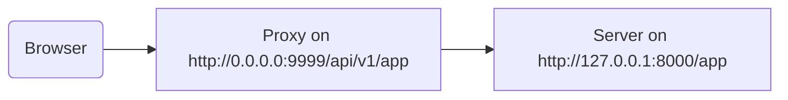

# Bir Proxy Arkasında

Bazı durumlarda, uygulamanız tarafından görülmeyen ek bir yol öneki ekleyen bir yapılandırmaya sahip Traefik veya Nginx gibi bir **proxy** sunucusu kullanmanız gerekebilir.

Bu durumlarda uygulamanızı yapılandırmak için `root_path`'i kullanabilirsiniz.

`root_path`, ASGI spesifikasyonu (FastAPI'nin Starlette aracılığıyla üzerine inşa edildiği) tarafından sağlanan bir mekanizmadır.

`root_path`, bu özel durumları ele almak için kullanılır.

Ve ayrıca alt uygulamaları bağlarken dahili olarak da kullanılır.

## Kırpılmış yol önekine sahip proxy

Kırpılmış yol önekine sahip bir proxyye sahip olmak, bu durumda, kodunuzda `/app` yolunda bir yol bildirebileceğiniz ama ardından üstüne bir katman (proxy) ekleyerek **FastAPI** uygulamanızı `/api/v1` gibi bir yol altına koyacağınız anlamına gelir.

Bu durumda, orijinal `/app` yolu aslında `/api/v1/app`'de sunulacaktır.

Tüm kodunuz sadece `/app` varmış gibi yazılmış olsa bile.

{* ../../docs_src/behind_a_proxy/tutorial001.py hl[6] *}

Ve proxy, isteği uygulama sunucusuna (muhtemelen FastAPI CLI aracılığıyla Uvicorn) iletmeden önce anında **yol önekini** **"kırpacak"**, böylece uygulamanız `/app`'de sunulduğuna ikna edilecek ve tüm kodunuzu `/api/v1` önekini dahil edecek şekilde güncellemeniz gerekmeyecektir.

Buraya kadar her şey normal şekilde çalışacaktır.

Ama ardından, entegre belgeler UI'ını (frontend) açtığınızda, OpenAPI şemasını `/api/v1/openapi.json` yerine `/openapi.json`'da almayı bekleyecektir.

Bu yüzden, frontend (tarayıcıda çalışan) `/openapi.json`'a ulaşmaya çalışacak ve OpenAPI şemasını alamayacaktır.

Uygulamamız için `/api/v1` yol önekine sahip bir proxyımız olduğundan, frontend'in OpenAPI şemasını `/api/v1/openapi.json`'da getirmesi gerekir.



/// tip

`0.0.0.0` IP'si genellikle programın o makinede/sunucuda mevcut tüm IP'leri dinlediği anlamına gelir.

///

Belge UI'ı ayrıca bu API `server`'ının `/api/v1`'de (proxynin arkasında) bulunduğunu bildirmek için OpenAPI şemasına da ihtiyaç duyacaktır. Örneğin:

```JSON hl_lines="4-8"
{
    "openapi": "3.1.0",
    // More stuff here
    "servers": [
        {
            "url": "/api/v1"
        }
    ],
    "paths": {
            // More stuff here
    }
}
```

Bu örnekte, "Proxy" **Traefik** gibi bir şey olabilir. Ve sunucu FastAPI CLI ile **Uvicorn** gibi bir şey olabilir, FastAPI uygulamanızı çalıştırıyor.

### `root_path`'i sağlama

Bunu başarmak için `--root-path` komut satırı seçeneğini şöyle kullanabilirsiniz:

<div class="termy">

```console
$ fastapi run main.py --root-path /api/v1

<span style="color: green;">INFO</span>:     Uvicorn running on http://127.0.0.1:8000 (Press CTRL+C to quit)
```

</div>

Hypercorn kullanıyorsanız, onun da `--root-path` seçeneği vardır.

/// note | Teknik Detaylar

ASGI spesifikasyonu bu kullanım durumu için bir `root_path` tanımlar.

Ve `--root-path` komut satırı seçeneği o `root_path`'i sağlar.

///

### Geçerli `root_path`'i kontrol etme

Uygulamanız tarafından her istek için kullanılan geçerli `root_path`'i alabilirsiniz, bu `scope` sözlüğünün bir parçasıdır (bu ASGI spesifikasyonunun bir parçasıdır).

Burada sadece gösterim amacıyla mesaja dahil ediyoruz.

{* ../../docs_src/behind_a_proxy/tutorial001.py hl[8] *}

Ardından, Uvicorn'u şu şekilde başlatırsanız:

<div class="termy">

```console
$ fastapi run main.py --root-path /api/v1

<span style="color: green;">INFO</span>:     Uvicorn running on http://127.0.0.1:8000 (Press CTRL+C to quit)
```

</div>

Yanıt şöyle bir şey olacaktır:

```JSON
{
    "message": "Hello World",
    "root_path": "/api/v1"
}
```

### FastAPI uygulamasında `root_path`'i ayarlama

Alternatif olarak, `--root-path` gibi bir komut satırı seçeneği veya eşdeğeri sağlama imkanınız yoksa, FastAPI uygulamanızı oluştururken `root_path` parametresini ayarlayabilirsiniz:

{* ../../docs_src/behind_a_proxy/tutorial002.py hl[3] *}

`root_path`'i `FastAPI`'ye iletmek, Uvicorn veya Hypercorn'a `--root-path` komut satırı seçeneğini iletmeye eşdeğer olacaktır.

### `root_path` hakkında

Sunucunun (Uvicorn) o `root_path`'i uygulamaya iletmekten başka bir şey için kullanmayacağını unutmayın.

Ama tarayıcınızla <a href="http://127.0.0.1:8000" class="external-link" target="_blank">http://127.0.0.1:8000/app</a>'a giderseniz normal yanıtı göreceksiniz:

```JSON
{
    "message": "Hello World",
    "root_path": "/api/v1"
}
```

Bu yüzden, `http://127.0.0.1:8000/api/v1/app`'de erişilmesini beklemeyecektir.

Uvicorn, proxy'nin Uvicorn'a `http://127.0.0.1:8000/app`'de erişmesini bekleyecek ve ardından üstüne ek `/api/v1` önekini eklemek proxy'nin sorumluluğu olacaktır.

## Kırpılmış yol önekine sahip proxy'ler hakkında

Kırpılmış yol önekine sahip bir proxy'nin onu yapılandırmanın yollarından yalnızca biri olduğunu unutmayın.

Muhtemelen birçok durumda varsayılan, proxy'nin kırpılmış yol öneki olmamasıdır.

Böyle bir durumda (kırpılmış yol öneki olmadan), proxy `https://myawesomeapp.com` gibi bir şeyi dinleyecek ve ardından tarayıcı `https://myawesomeapp.com/api/v1/app`'e giderse ve sunucunuz (örneğin Uvicorn) `http://127.0.0.1:8000`'de dinliyorsa, proxy (kırpılmış yol öneki olmadan) Uvicorn'a aynı yolda erişecektir: `http://127.0.0.1:8000/api/v1/app`.

## Traefik ile yerel olarak test etme

Kırpılmış yol önekiyle deneyi <a href="https://docs.traefik.io/" class="external-link" target="_blank">Traefik</a> kullanarak kolayca yerel olarak çalıştırabilirsiniz.

<a href="https://github.com/containous/traefik/releases" class="external-link" target="_blank">Traefik'i indirin</a>, tek bir ikili dosyadır, sıkıştırılmış dosyayı çıkarabilir ve doğrudan terminalden çalıştırabilirsiniz.

Ardından bir `traefik.toml` dosyası oluşturun:

```TOML hl_lines="3"
[entryPoints]
  [entryPoints.http]
    address = ":9999"

[providers]
  [providers.file]
    filename = "routes.toml"
```

Bu, Traefik'e 9999 portunu dinlemesini ve başka bir `routes.toml` dosyasını kullanmasını söyler.

/// tip

Yönetici (`sudo`) ayrıcalıklarıyla çalıştırmak zorunda kalmamak için standart HTTP portu 80 yerine 9999 portunu kullanıyoruz.

///

Şimdi o diğer `routes.toml` dosyasını oluşturun:

```TOML hl_lines="5  12  20"
[http]
  [http.middlewares]

    [http.middlewares.api-stripprefix.stripPrefix]
      prefixes = ["/api/v1"]

  [http.routers]

    [http.routers.app-http]
      entryPoints = ["http"]
      service = "app"
      rule = "PathPrefix(`/api/v1`)"
      middlewares = ["api-stripprefix"]

  [http.services]

    [http.services.app]
      [http.services.app.loadBalancer]
        [[http.services.app.loadBalancer.servers]]
          url = "http://127.0.0.1:8000"
```

Bu dosya Traefik'i `/api/v1` yol önekini kullanacak şekilde yapılandırır.

Ve ardından Traefik isteklerini `http://127.0.0.1:8000`'de çalışan Uvicorn'unuza yönlendirecektir.

Şimdi Traefik'i başlatın:

<div class="termy">

```console
$ ./traefik --configFile=traefik.toml

INFO[0000] Configuration loaded from file: /home/user/awesomeapi/traefik.toml
```

</div>

Ve şimdi uygulamanızı `--root-path` seçeneğiyle başlatın:

<div class="termy">

```console
$ fastapi run main.py --root-path /api/v1

<span style="color: green;">INFO</span>:     Uvicorn running on http://127.0.0.1:8000 (Press CTRL+C to quit)
```

</div>

### Yanıtları kontrol edin

Şimdi, Uvicorn için port ile URL'ye giderseniz: <a href="http://127.0.0.1:8000/app" class="external-link" target="_blank">http://127.0.0.1:8000/app</a>, normal yanıtı göreceksiniz:

```JSON
{
    "message": "Hello World",
    "root_path": "/api/v1"
}
```

/// tip

`http://127.0.0.1:8000/app`'de erişiyor olsanız bile, `--root-path` seçeneğinden alınan `/api/v1`'in `root_path`'ini gösterdiğine dikkat edin.

///

Ve şimdi yol öneki dahil Traefik için port ile URL'yi açın: <a href="http://127.0.0.1:9999/api/v1/app" class="external-link" target="_blank">http://127.0.0.1:9999/api/v1/app</a>.

Aynı yanıtı alıyoruz:

```JSON
{
    "message": "Hello World",
    "root_path": "/api/v1"
}
```

ama bu sefer proxy tarafından sağlanan önek yoluna sahip URL'de: `/api/v1`.

Elbette, buradaki fikir herkesin uygulamaya proxy aracılığıyla erişeceğidir, bu yüzden `/api/v1` yol önekine sahip sürüm "doğru" olanıdır.

Ve yol öneki olmayan sürüm (`http://127.0.0.1:8000/app`), Uvicorn tarafından doğrudan sağlanan, yalnızca _proxy_'nin (Traefik) erişmesi içindir.

Bu, Proxy'nin (Traefik) yol önekini nasıl kullandığını ve sunucunun (Uvicorn) `--root-path` seçeneğinden `root_path`'i nasıl kullandığını gösterir.

### Belgeler UI'ını kontrol edin

Ama eğlenceli kısım burada. ✨

Uygulamaya erişmenin "resmi" yolu, tanımladığımız yol önekiyle proxy aracılığıyla olacaktır. Bu yüzden, beklediğimiz gibi, Uvicorn tarafından doğrudan sunulan belgeler UI'ını URL'de yol öneki olmadan denerseniz, çalışmayacaktır, çünkü proxy aracılığıyla erişilmesini beklemektedir.

<a href="http://127.0.0.1:8000/docs" class="external-link" target="_blank">http://127.0.0.1:8000/docs</a>'da kontrol edebilirsiniz:


Ama belgeler UI'ına proxy ile port `9999` kullanarak "resmi" URL'de, `/api/v1/docs`'da erişirsek, doğru çalışır! 🎉

<a href="http://127.0.0.1:9999/api/v1/docs" class="external-link" target="_blank">http://127.0.0.1:9999/api/v1/docs</a>'da kontrol edebilirsiniz:


Tam istediğimiz gibi. ✔️

Bu, FastAPI'nin `root_path` tarafından sağlanan URL ile OpenAPI'de varsayılan `server`'ı oluşturmak için bu `root_path`'i kullanmasındandır.

## Ek sunucular

/// warning

Bu daha gelişmiş bir kullanım durumudur. Atlamaktan çekinmeyin.

///

Varsayılan olarak, **FastAPI** OpenAPI şemasında `root_path` için URL ile bir `server` oluşturacaktır.

Ama ayrıca diğer alternatif `servers`'ı da sağlayabilirsiniz, örneğin *aynı* belgeler UI'ının hem hazırlama hem de üretim ortamıyla etkileşim kurmasını istiyorsanız.

Özel bir `servers` listesi iletirseniz ve bir `root_path` varsa (API'niz bir proxy arkasında olduğu için), **FastAPI** bu `root_path` ile listenin başına bir "server" ekleyecektir.

Örneğin:

{* ../../docs_src/behind_a_proxy/tutorial003.py hl[4:7] *}

Şöyle bir OpenAPI şeması oluşturacaktır:

```JSON hl_lines="5-7"
{
    "openapi": "3.1.0",
    // More stuff here
    "servers": [
        {
            "url": "/api/v1"
        },
        {
            "url": "https://stag.example.com",
            "description": "Staging environment"
        },
        {
            "url": "https://prod.example.com",
            "description": "Production environment"
        }
    ],
    "paths": {
            // More stuff here
    }
}
```

/// tip

`root_path`'ten alınan `/api/v1` `url` değerine sahip otomatik oluşturulan sunucuya dikkat edin.

///

<a href="http://127.0.0.1:9999/api/v1/docs" class="external-link" target="_blank">http://127.0.0.1:9999/api/v1/docs</a>'daki belgeler UI'ında şöyle görünecektir:


/// tip

Belgeler UI'ı seçtiğiniz sunucuyla etkileşim kuracaktır.

///

### `root_path`'ten otomatik sunucuyu devre dışı bırakma

**FastAPI**'nin `root_path` kullanan otomatik bir sunucu dahil etmesini istemiyorsanız, `root_path_in_servers=False` parametresini kullanabilirsiniz:

{* ../../docs_src/behind_a_proxy/tutorial004.py hl[9] *}

ve ardından OpenAPI şemasına dahil etmeyecektir.

## Bir alt uygulama bağlama

[Alt Uygulamalar - Bağlama](sub-applications.md){.internal-link target=_blank}'da açıklandığı gibi bir alt uygulama bağlamanız ve aynı zamanda `root_path` ile bir proxy kullanmanız gerekiyorsa, bunu beklediğiniz gibi normal şekilde yapabilirsiniz.

FastAPI dahili olarak `root_path`'i akıllıca kullanacaktır, bu yüzden sorunsuz çalışacaktır. ✨
