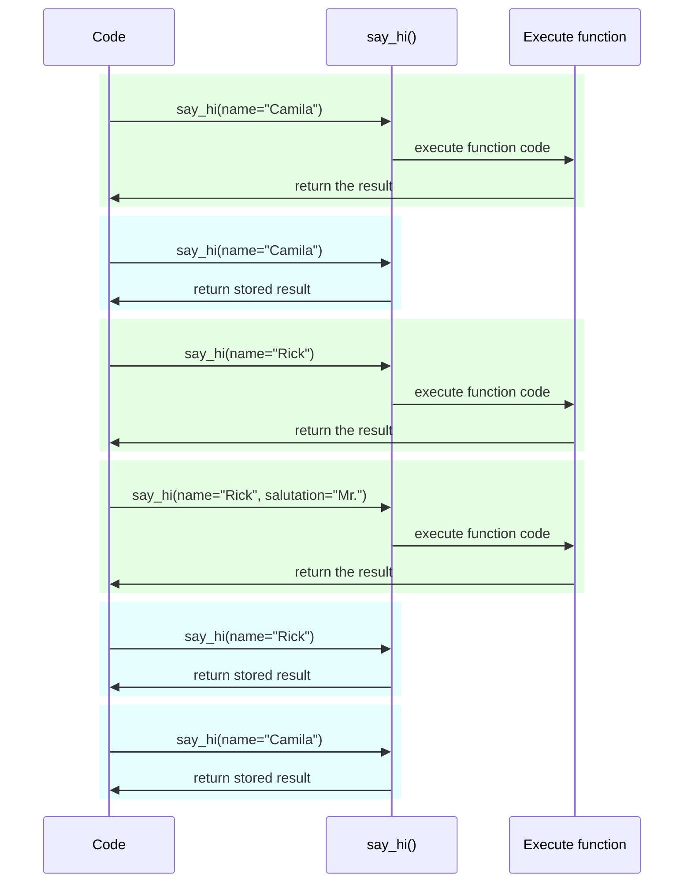

# Ayarlar ve Ortam Değişkenleri

Birçok durumda uygulamanızın gizli anahtarlar, veritabanı kimlik bilgileri, e-posta hizmetleri için kimlik bilgileri vb. gibi bazı harici ayarlara veya yapılandırmalara ihtiyacı olabilir.

Bu ayarların çoğu değişkendir (değişebilir), veritabanı URL'leri gibi. Ve birçoğu gizli olabilir, gizli anahtarlar gibi.

Bu nedenle bunları uygulama tarafından okunan ortam değişkenlerinde sağlamak yaygındır.

/// tip

Ortam değişkenlerini anlamak için [Ortam Değişkenleri](../environment-variables.md){.internal-link target=_blank}'ni okuyabilirsiniz.

///

## Türler ve doğrulama

Bu ortam değişkenleri yalnızca metin dizelerini işleyebilir, çünkü Python'un dışındadırlar ve diğer programlar ve sistemin geri kalanıyla (ve hatta Linux, Windows, macOS gibi farklı işletim sistemleriyle) uyumlu olmalıdırlar.

Bu, Python'da bir ortam değişkeninden okunan herhangi bir değerin bir `str` olacağı ve farklı bir türe dönüştürme veya herhangi bir doğrulamanın kodda yapılması gerektiği anlamına gelir.

## Pydantic `Settings`

Neyse ki, Pydantic ortam değişkenlerinden gelen bu ayarları <a href="https://docs.pydantic.dev/latest/concepts/pydantic_settings/" class="external-link" target="_blank">Pydantic: Settings management</a> ile ele almak için harika bir yardımcı araç sağlar.

### `pydantic-settings`'i yükleyin

Önce, [sanal ortamınızı](../virtual-environments.md){.internal-link target=_blank} oluşturduğunuzdan, etkinleştirdiğinizden emin olun ve ardından `pydantic-settings` paketini yükleyin:

<div class="termy">

```console
$ pip install pydantic-settings
---> 100%
```

</div>

`all` ekstraları ile yüklediğinizde de dahil olarak gelir:

<div class="termy">

```console
$ pip install "fastapi[all]"
---> 100%
```

</div>

/// info

Pydantic v1'de ana paketle birlikte geliyordu. Şimdi bu bağımsız paket olarak dağıtılıyor, böylece o işlevselliğe ihtiyacınız yoksa yükleyip yüklememeyeceğinizi seçebilirsiniz.

///

### `Settings` nesnesini oluşturun

Pydantic'ten `BaseSettings`'i içe aktarın ve bir Pydantic modeline çok benzer şekilde bir alt sınıf oluşturun.

Pydantic modellerinde olduğu gibi, tür açıklamalarıyla sınıf öznitelikleri ve muhtemelen varsayılan değerler bildirirsiniz.

Pydantic modelleri için kullandığınız tüm aynı doğrulama özelliklerini ve araçlarını kullanabilirsiniz, farklı veri türleri ve `Field()` ile ek doğrulamalar gibi.

//// tab | Pydantic v2

{* ../../docs_src/settings/tutorial001.py hl[2,5:8,11] *}

////

//// tab | Pydantic v1

/// info

Pydantic v1'de `pydantic_settings`'den değil doğrudan `pydantic`'ten `BaseSettings`'i içe aktarırdınız.

///

{* ../../docs_src/settings/tutorial001_pv1.py hl[2,5:8,11] *}

////

/// tip

Kopyalayıp yapıştırmak için hızlı bir şey istiyorsanız, bu örneği kullanmayın, aşağıdaki son örneği kullanın.

///

Ardından, o `Settings` sınıfının bir örneğini oluşturduğunuzda (bu durumda `settings` nesnesinde), Pydantic ortam değişkenlerini büyük/küçük harfe duyarsız bir şekilde okuyacaktır, bu yüzden büyük harfli bir `APP_NAME` değişkeni yine de `app_name` özniteliği için okunacaktır.

Ardından verileri dönüştürüp doğrulayacaktır. Yani, o `settings` nesnesini kullandığınızda, bildirdiğiniz türlerde verilere sahip olacaksınız (örneğin `items_per_user` bir `int` olacaktır).

### `settings`'i kullanma

Ardından yeni `settings` nesnesini uygulamanızda kullanabilirsiniz:

{* ../../docs_src/settings/tutorial001.py hl[18:20] *}

### Sunucuyu çalıştırma

Ardından, yapılandırmaları ortam değişkenleri olarak ileterek sunucuyu çalıştırırsınız, örneğin bir `ADMIN_EMAIL` ve `APP_NAME` ayarlayabilirsiniz:

<div class="termy">

```console
$ ADMIN_EMAIL="deadpool@example.com" APP_NAME="ChimichangApp" fastapi run main.py

<span style="color: green;">INFO</span>:     Uvicorn running on http://127.0.0.1:8000 (Press CTRL+C to quit)
```

</div>

/// tip

Tek bir komut için birden fazla ortam değişkeni ayarlamak üzere bunları bir boşlukla ayırın ve hepsini komuttan önce koyun.

///

Ve ardından `admin_email` ayarı `"deadpool@example.com"` olarak ayarlanacaktır.

`app_name` `"ChimichangApp"` olacaktır.

Ve `items_per_user` varsayılan değeri olan `50`'yi koruyacaktır.

## Başka bir modülde ayarlar

Bu ayarları [Daha Büyük Uygulamalar - Birden Fazla Dosya](../tutorial/bigger-applications.md){.internal-link target=_blank}'da gördüğünüz gibi başka bir modül dosyasına koyabilirsiniz.

Örneğin, bir `config.py` dosyanız olabilir:

{* ../../docs_src/settings/app01/config.py *}

Ve ardından bir `main.py` dosyasında kullanabilirsiniz:

{* ../../docs_src/settings/app01/main.py hl[3,11:13] *}

/// tip

[Daha Büyük Uygulamalar - Birden Fazla Dosya](../tutorial/bigger-applications.md){.internal-link target=_blank}'da gördüğünüz gibi bir `__init__.py` dosyasına da ihtiyacınız olacaktır.

///

## Bir bağımlılıkta ayarlar

Bazı durumlarda, her yerde kullanılan `settings` ile global bir nesneye sahip olmak yerine, ayarları bir bağımlılıktan sağlamak yararlı olabilir.

Bu, özellikle test sırasında yararlı olabilir, çünkü bir bağımlılığı kendi özel ayarlarınızla geçersiz kılmak çok kolaydır.

### Yapılandırma dosyası

Önceki örnekten gelen `config.py` dosyanız şöyle görünebilir:

{* ../../docs_src/settings/app02/config.py hl[10] *}

Artık varsayılan bir `settings = Settings()` örneği oluşturmadığımıza dikkat edin.

### Ana uygulama dosyası

Şimdi yeni bir `config.Settings()` döndüren bir bağımlılık oluşturuyoruz.

{* ../../docs_src/settings/app02_an_py39/main.py hl[6,12:13] *}

/// tip

`@lru_cache`'i birazdan tartışacağız.

Şimdilik `get_settings()`'in normal bir fonksiyon olduğunu varsayabilirsiniz.

///

Ve ardından *yol operasyonu fonksiyonundan* bir bağımlılık olarak talep edebilir ve ihtiyacımız olan her yerde kullanabiliriz.

{* ../../docs_src/settings/app02_an_py39/main.py hl[17,19:21] *}

### Ayarlar ve test

Ardından test sırasında `get_settings` için bir bağımlılık geçersiz kılma oluşturarak farklı bir ayarlar nesnesi sağlamak çok kolay olacaktır:

{* ../../docs_src/settings/app02/test_main.py hl[9:10,13,21] *}

Bağımlılık geçersiz kılmada, yeni `Settings` nesnesini oluştururken `admin_email` için yeni bir değer ayarlıyoruz ve ardından o yeni nesneyi döndürüyoruz.

Ardından kullanıldığını test edebiliriz.

## `.env` dosyası okuma

Muhtemelen farklı ortamlarda çok değişebilen birçok ayarınız varsa, bunları bir dosyaya koymak ve ardından ortam değişkenleriymiş gibi dosyadan okumak yararlı olabilir.

Bu uygulama yeterince yaygındır ve bir adı vardır, bu ortam değişkenleri genellikle `.env` adlı bir dosyaya yerleştirilir ve dosyaya "dotenv" denir.

/// tip

Nokta (`.`) ile başlayan bir dosya, Linux ve macOS gibi Unix benzeri sistemlerde gizli bir dosyadır.

Ama bir dotenv dosyasının tam olarak o dosya adına sahip olması gerekmez.

///

Pydantic, harici bir kütüphane kullanarak bu tür dosyalardan okuma desteğine sahiptir. Daha fazlasını <a href="https://docs.pydantic.dev/latest/concepts/pydantic_settings/#dotenv-env-support" class="external-link" target="_blank">Pydantic Settings: Dotenv (.env) support</a>'ta okuyabilirsiniz.

/// tip

Bunun çalışması için `pip install python-dotenv` yapmanız gerekir.

///

### `.env` dosyası

Bir `.env` dosyanız olabilir:

```bash
ADMIN_EMAIL="deadpool@example.com"
APP_NAME="ChimichangApp"
```

### `.env`'den ayarları okuma

Ve ardından `config.py`'nizi şu şekilde güncelleyin:

//// tab | Pydantic v2

{* ../../docs_src/settings/app03_an/config.py hl[9] *}

/// tip

`model_config` özniteliği yalnızca Pydantic yapılandırması için kullanılır. Daha fazlasını <a href="https://docs.pydantic.dev/latest/concepts/config/" class="external-link" target="_blank">Pydantic: Concepts: Configuration</a>'da okuyabilirsiniz.

///

////

//// tab | Pydantic v1

{* ../../docs_src/settings/app03_an/config_pv1.py hl[9:10] *}

/// tip

`Config` sınıfı yalnızca Pydantic yapılandırması için kullanılır. Daha fazlasını <a href="https://docs.pydantic.dev/1.10/usage/model_config/" class="external-link" target="_blank">Pydantic Model Config</a>'da okuyabilirsiniz.

///

////

/// info

Pydantic sürüm 1'de yapılandırma dahili bir `Config` sınıfında yapılıyordu, Pydantic sürüm 2'de bir `model_config` özniteliğinde yapılır. Bu öznitelik bir `dict` alır ve otomatik tamamlama ile satır içi hatalar almak için o `dict`'i tanımlamak üzere `SettingsConfigDict`'i içe aktarabilir ve kullanabilirsiniz.

///

Burada Pydantic `Settings` sınıfınızın içinde `env_file` yapılandırmasını tanımlıyoruz ve değeri kullanmak istediğimiz dotenv dosyasının dosya adı olarak ayarlıyoruz.

### `Settings`'i `lru_cache` ile yalnızca bir kez oluşturma

Diskten bir dosya okumak normalde maliyetli (yavaş) bir işlemdir, bu yüzden muhtemelen bunu yalnızca bir kez yapmak ve ardından her istek için okumak yerine aynı ayarlar nesnesini yeniden kullanmak istersiniz.

Ama her seferinde:

```Python
Settings()
```

yaptığımızda yeni bir `Settings` nesnesi oluşturulacak ve oluşturma sırasında `.env` dosyasını tekrar okuyacaktır.

Bağımlılık fonksiyonu sadece şöyle olsaydı:

```Python
def get_settings():
    return Settings()
```

her istek için o nesneyi oluştururduk ve her istek için `.env` dosyasını okurduk. ⚠️

Ama üstünde `@lru_cache` dekoratörünü kullandığımız için, `Settings` nesnesi yalnızca bir kez oluşturulacak, ilk çağrıldığında. ✔️

{* ../../docs_src/settings/app03_an_py39/main.py hl[1,11] *}

Ardından sonraki istekler için bağımlılıklardaki `get_settings()`'in herhangi bir sonraki çağrısında, `get_settings()`'in dahili kodunu çalıştırıp yeni bir `Settings` nesnesi oluşturmak yerine, ilk çağrıda döndürülen aynı nesneyi tekrar tekrar döndürecektir.

#### `lru_cache` Teknik Detaylar

`@lru_cache`, fonksiyonun her çağrıldığında kodunu çalıştırıp tekrar hesaplamak yerine, ilk kez döndürülen aynı değeri döndürmek üzere dekore ettiği fonksiyonu değiştirir.

Böylece, altındaki fonksiyon her argüman kombinasyonu için bir kez çalıştırılacaktır. Ve ardından bu argüman kombinasyonlarının her biri tarafından döndürülen değerler, fonksiyon tam olarak aynı argüman kombinasyonuyla çağrıldığında tekrar tekrar kullanılacaktır.

Örneğin, şöyle bir fonksiyonunuz varsa:

```Python
@lru_cache
def say_hi(name: str, salutation: str = "Ms."):
    return f"Hello {salutation} {name}"
```

programınız şöyle çalışabilir:



Bağımlılığımız `get_settings()` durumunda, fonksiyon herhangi bir argüman bile almıyor, bu yüzden her zaman aynı değeri döndürür.

Bu şekilde, neredeyse sadece global bir değişkenmiş gibi davranır. Ama bir bağımlılık fonksiyonu kullandığı için, test sırasında kolayca geçersiz kılabiliriz.

`@lru_cache`, Python'un standart kütüphanesinin bir parçası olan `functools`'un bir parçasıdır, daha fazlasını <a href="https://docs.python.org/3/library/functools.html#functools.lru_cache" class="external-link" target="_blank">`@lru_cache` için Python belgelerinde</a> okuyabilirsiniz.

## Özet

Pydantic modellerinin tüm gücüyle uygulamanız için ayarları veya yapılandırmaları yönetmek üzere Pydantic Settings'i kullanabilirsiniz.

* Bir bağımlılık kullanarak testi basitleştirebilirsiniz.
* `.env` dosyalarını onunla kullanabilirsiniz.
* `@lru_cache` kullanmak, her istek için dotenv dosyasını tekrar tekrar okumaktan kaçınmanıza olanak tanırken, test sırasında geçersiz kılmanıza izin verir.
