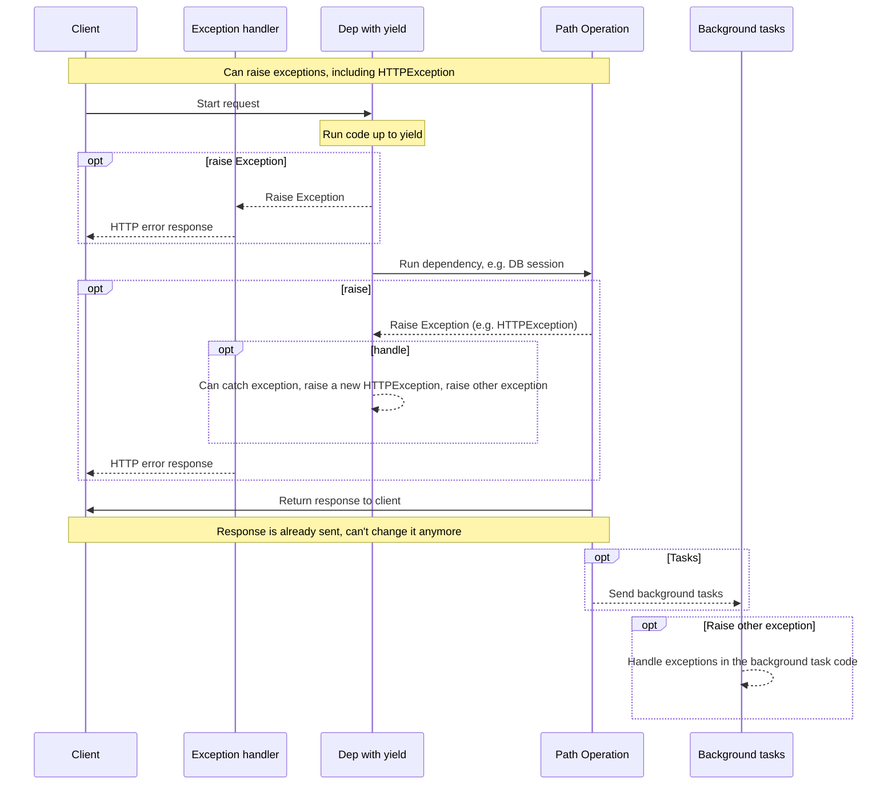

# yield ile Bağımlılıklar

FastAPI, <abbr title='bazen "çıkış kodu", "temizlik kodu", "sonlandırma kodu", "kapanış kodu", "bağlam yöneticisi çıkış kodu" vb. olarak da adlandırılır'>bittikten sonra bazı ek adımlar yapan</abbr> bağımlılıkları destekler.

Bunu yapmak için, `return` yerine `yield` kullanın ve ek adımları (kodu) sonra yazın.

/// tip

Her bağımlılık başına `yield`'ı bir kez kullandığınızdan emin olun.

///

/// note | Teknik Detaylar

Şunlarla kullanılmaya uygun olan herhangi bir fonksiyon:

* <a href="https://docs.python.org/3/library/contextlib.html#contextlib.contextmanager" class="external-link" target="_blank">`@contextlib.contextmanager`</a> veya
* <a href="https://docs.python.org/3/library/contextlib.html#contextlib.asynccontextmanager" class="external-link" target="_blank">`@contextlib.asynccontextmanager`</a>

**FastAPI** bağımlılığı olarak kullanılmak üzere geçerli olacaktır.

Aslında, FastAPI dahili olarak bu iki dekoratörü kullanır.

///

## `yield` ile bir veritabanı bağımlılığı

Örneğin, bunu bir veritabanı oturumu oluşturmak ve bittikten sonra kapatmak için kullanabilirsiniz.

Yalnızca `yield` ifadesi dahil ve öncesindeki kod, yanıt oluşturulmadan önce çalıştırılır:

{* ../../docs_src/dependencies/tutorial007.py hl[2:4] *}

Verilen (yield edilen) değer, *yol operasyonlarına* ve diğer bağımlılıklara enjekte edilen şeydir:

{* ../../docs_src/dependencies/tutorial007.py hl[4] *}

`yield` ifadesini takip eden kod, yanıt oluşturulduktan sonra ancak gönderilmeden önce çalıştırılır:

{* ../../docs_src/dependencies/tutorial007.py hl[5:6] *}

/// tip

`async` veya normal fonksiyonlar kullanabilirsiniz.

**FastAPI**, normal bağımlılıklarla aynı şekilde, her biriyle doğru olanı yapacaktır.

///

## `yield` ve `try` ile bir bağımlılık

`yield` ile bir bağımlılıkta `try` bloğu kullanırsanız, bağımlılık kullanılırken fırlatılan herhangi bir istisnayı alırsınız.

Örneğin, bir noktada ortada, başka bir bağımlılıkta veya bir *yol operasyonunda* bir veritabanı işlemi "geri alma" yaptıysa veya başka bir hata oluşturduysa, bağımlılığınızda istisnayı alırsınız.

Bu yüzden, bağımlılık içinde `except SomeException` ile o belirli istisnayı arayabilirsiniz.

Aynı şekilde, bir istisna olup olmadığına bakılmaksızın çıkış adımlarının çalıştırılmasını sağlamak için `finally` kullanabilirsiniz.

{* ../../docs_src/dependencies/tutorial007.py hl[3,5] *}

## `yield` ile alt bağımlılıklar

Herhangi bir boyut ve şekilde alt bağımlılıklara ve alt bağımlılık "ağaçlarına" sahip olabilirsiniz ve bunların herhangi biri veya tümü `yield` kullanabilir.

**FastAPI**, `yield` ile her bağımlılıktaki "çıkış kodunun" doğru sırada çalıştırılmasını sağlayacaktır.

Örneğin, `dependency_c`, `dependency_b`'ye bağımlı olabilir ve `dependency_b`, `dependency_a`'ya bağımlı olabilir:

{* ../../docs_src/dependencies/tutorial008_an_py39.py hl[6,14,22] *}

Ve hepsi `yield` kullanabilir.

Bu durumda `dependency_c`, çıkış kodunu çalıştırmak için `dependency_b`'nin (burada `dep_b` olarak adlandırılmış) değerinin hala mevcut olmasına ihtiyaç duyar.

Ve sırasıyla `dependency_b`, çıkış kodu için `dependency_a`'nın (burada `dep_a` olarak adlandırılmış) değerinin mevcut olmasına ihtiyaç duyar.

{* ../../docs_src/dependencies/tutorial008_an_py39.py hl[18:19,26:27] *}

Aynı şekilde, bazı bağımlılıklar `yield` ile ve diğer bazı bağımlılıklar `return` ile olabilir ve bunlardan bazıları diğerlerine bağımlı olabilir.

Ve tek bir bağımlılığın `yield` ile birden fazla başka bağımlılık gerektirmesi de mümkündür, vb.

İstediğiniz herhangi bir bağımlılık kombinasyonuna sahip olabilirsiniz.

**FastAPI** her şeyin doğru sırada çalıştırılmasını sağlayacaktır.

/// note | Teknik Detaylar

Bu, Python'un <a href="https://docs.python.org/3/library/contextlib.html" class="external-link" target="_blank">Bağlam Yöneticileri</a> sayesinde çalışır.

**FastAPI** bunu başarmak için bunları dahili olarak kullanır.

///

## `yield` ve `HTTPException` ile bağımlılıklar

`yield` ile bağımlılıkları kullanabileceğinizi ve istisnaları yakalayan `try` bloklarına sahip olabileceğinizi gördünüz.

Aynı şekilde, `yield`'dan sonra çıkış kodunda bir `HTTPException` veya benzeri fırlatabilirsiniz.

/// tip

Bu biraz ileri düzey bir tekniktir ve çoğu durumda gerçekten ihtiyacınız olmayacaktır, çünkü istisnaları (dahil `HTTPException`) uygulamanızın geri kalan kodundan, örneğin *yol operasyonu fonksiyonundan* fırlatabilirsiniz.

Ama ihtiyacınız olursa orada sizin için var. 🤓

///

{* ../../docs_src/dependencies/tutorial008b_an_py39.py hl[18:22,31] *}

Kullanabileceğiniz bir alternatif, istisnaları yakalamak (ve muhtemelen başka bir `HTTPException` fırlatmak) için bir [Özel İstisna İşleyicisi](../handling-errors.md#install-custom-exception-handlers){.internal-link target=_blank} oluşturmaktır.

## `yield` ve `except` ile bağımlılıklar

`yield` ile bir bağımlılıkta `except` kullanarak bir istisna yakalarsanız ve tekrar fırlatmazsanız (veya yeni bir istisna fırlatmazsanız), FastAPI normal Python'da olacağı gibi bir istisna olduğunu fark edemeyecektir:

{* ../../docs_src/dependencies/tutorial008c_an_py39.py hl[15:16] *}

Bu durumda, istemci bir *HTTP 500 Internal Server Error* yanıtı görecektir, olması gerektiği gibi, çünkü bir `HTTPException` veya benzeri fırlatmıyoruz, ancak sunucu hatanın ne olduğuna dair **hiçbir günlük kaydı** veya başka bir gösterge almayacaktır. 😱

### `yield` ve `except` ile bağımlılıklarda her zaman `raise` edin

`yield` ile bir bağımlılıkta bir istisna yakalarsanız, başka bir `HTTPException` veya benzeri fırlatmadığınız sürece, orijinal istisnayı yeniden fırlatmalısınız.

`raise` kullanarak aynı istisnayı yeniden fırlatabilirsiniz:

{* ../../docs_src/dependencies/tutorial008d_an_py39.py hl[17] *}

Şimdi istemci aynı *HTTP 500 Internal Server Error* yanıtını alacak, ancak sunucu günlüklerde özel `InternalError`'ımızı tutacaktır. 😎

## `yield` ile bağımlılıkların çalıştırılması

Çalıştırma sırası aşağı yukarı bu diyagram gibidir. Zaman yukarıdan aşağıya akar. Ve her sütun, etkileşen veya kod çalıştıran parçalardan biridir.



/// info

İstemciye yalnızca **bir yanıt** gönderilecektir. Bu, hata yanıtlarından biri olabilir veya *yol operasyonundan* gelen yanıt olacaktır.

Bu yanıtlardan biri gönderildikten sonra, başka yanıt gönderilemez.

///

/// tip

Bu diyagram `HTTPException` gösterir, ancak `yield` ile bir bağımlılıkta yakaladığınız herhangi bir istisnayı veya bir [Özel İstisna İşleyicisi](../handling-errors.md#install-custom-exception-handlers){.internal-link target=_blank} ile de fırlatabilirsiniz.

Herhangi bir istisna fırlatırsanız, `HTTPException` dahil, `yield` ile bağımlılıklara iletilecektir. Çoğu durumda bu aynı istisnayı veya yeni birini `yield` ile bağımlılıktan yeniden fırlatarak düzgün şekilde işlendiğinden emin olmak isteyeceksiniz.

///

## `yield`, `HTTPException`, `except` ve Arka Plan Görevleri ile Bağımlılıklar

/// warning

Muhtemelen bu teknik ayrıntılara ihtiyacınız yoktur, bu bölümü atlayıp aşağıdan devam edebilirsiniz.

Bu ayrıntılar, 0.106.0'dan önceki bir FastAPI sürümü kullanıyorsanız ve arka plan görevlerinde `yield` ile bağımlılıklardan kaynakları kullandıysanız çoğunlukla faydalıdır.

///

### `yield` ve `except` ile Bağımlılıklar, Teknik Detaylar

FastAPI 0.110.0'dan önce, `yield` ile bir bağımlılık kullandıysanız ve ardından o bağımlılıkta `except` ile bir istisna yakaladıysanız ve istisnayı tekrar fırlatmadıysanız, istisna otomatik olarak herhangi bir istisna işleyicisine veya dahili sunucu hatası işleyicisine iletiliyordu/yönlendiriliyordu.

Bu, işleyicisi olmayan yönlendirilen istisnalardan kaynaklanan işlenmeyen bellek tüketimini düzeltmek (dahili sunucu hataları) ve bunu normal Python kodunun davranışıyla tutarlı hale getirmek için 0.110.0 sürümünde değiştirildi.

### Arka Plan Görevleri ve `yield` ile Bağımlılıklar, Teknik Detaylar

FastAPI 0.106.0'dan önce, `yield`'dan sonra istisna fırlatmak mümkün değildi, `yield` ile bağımlılıklardaki çıkış kodu yanıt gönderildikten *sonra* çalıştırılıyordu, bu yüzden [İstisna İşleyicileri](../handling-errors.md#install-custom-exception-handlers){.internal-link target=_blank} zaten çalışmış olurdu.

Bu, arka plan görevleri içinde bağımlılıklar tarafından "verilen (yield edilen)" aynı nesnelerin kullanılmasına olanak tanımak için ağırlıklı olarak bu şekilde tasarlanmıştı, çünkü çıkış kodu arka plan görevleri tamamlandıktan sonra çalıştırılacaktı.

Yine de, bu, yanıtın ağ üzerinden yolculuk etmesini beklerken, `yield` ile bir bağımlılıkta gereksiz yere bir kaynağı (örneğin bir veritabanı bağlantısı) tutmak anlamına geleceğinden, bu FastAPI 0.106.0'da değiştirildi.

/// tip

Ayrıca, bir arka plan görevi normalde kendi kaynaklarıyla (örn. kendi veritabanı bağlantısı) ayrı olarak işlenmesi gereken bağımsız bir mantık kümesidir.

Bu şekilde muhtemelen daha temiz bir koda sahip olacaksınız.

///

Bu davranışa güveniyorsanız, artık arka plan görevleri için kaynakları arka plan görevinin kendisinin içinde oluşturmalı ve dahili olarak yalnızca `yield` ile bağımlılıkların kaynaklarına bağımlı olmayan verileri kullanmalısınız.

Örneğin, aynı veritabanı oturumunu kullanmak yerine, arka plan görevinin içinde yeni bir veritabanı oturumu oluşturursunuz ve bu yeni oturumu kullanarak veritabanından nesneleri alırsınız. Ve ardından veritabanı nesnesini arka plan görev fonksiyonuna parametre olarak iletmek yerine, o nesnenin ID'sini iletir ve ardından arka plan görev fonksiyonunun içinde nesneyi tekrar alırsınız.

## Bağlam Yöneticileri

### "Bağlam Yöneticileri" Nedir

"Bağlam Yöneticileri", bir `with` ifadesinde kullanabileceğiniz Python nesnelerinden herhangi biridir.

Örneğin, <a href="https://docs.python.org/3/tutorial/inputoutput.html#reading-and-writing-files" class="external-link" target="_blank">bir dosyayı okumak için `with` kullanabilirsiniz</a>:

```Python
with open("./somefile.txt") as f:
    contents = f.read()
    print(contents)
```

Perde arkasında, `open("./somefile.txt")` bir "Bağlam Yöneticisi" adı verilen bir nesne oluşturur.

`with` bloğu bittiğinde, istisnalar olsa bile dosyayı kapatır.

`yield` ile bir bağımlılık oluşturduğunuzda, **FastAPI** dahili olarak bunun için bir bağlam yöneticisi oluşturacak ve diğer ilgili araçlarla birleştirecektir.

### `yield` ile bağımlılıklarda bağlam yöneticileri kullanma

/// warning

Bu, aşağı yukarı, "ileri düzey" bir fikirdir.

**FastAPI** ile yeni başlıyorsanız, şimdilik atlamak isteyebilirsiniz.

///

Python'da, <a href="https://docs.python.org/3/reference/datamodel.html#context-managers" class="external-link" target="_blank">iki metodu olan bir sınıf oluşturarak Bağlam Yöneticileri oluşturabilirsiniz: `__enter__()` ve `__exit__()`</a>.

Bunları ayrıca bağımlılık fonksiyonunun içinde `with` veya `async with` ifadelerini kullanarak `yield` ile **FastAPI** bağımlılıklarında da kullanabilirsiniz:

{* ../../docs_src/dependencies/tutorial010.py hl[1:9,13] *}

/// tip

Bağlam yöneticisi oluşturmanın başka bir yolu şunlardır:

* <a href="https://docs.python.org/3/library/contextlib.html#contextlib.contextmanager" class="external-link" target="_blank">`@contextlib.contextmanager`</a> veya
* <a href="https://docs.python.org/3/library/contextlib.html#contextlib.asynccontextmanager" class="external-link" target="_blank">`@contextlib.asynccontextmanager`</a>

bunları tek bir `yield` ile bir fonksiyonu dekore etmek için kullanarak.

**FastAPI**'nin `yield` ile bağımlılıklar için dahili olarak kullandığı şey budur.

Ancak FastAPI bağımlılıkları için dekoratörleri kullanmanız gerekmez (ve kullanmamalısınız).

FastAPI bunu dahili olarak sizin için yapacaktır.

///
