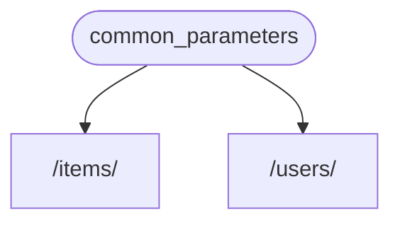
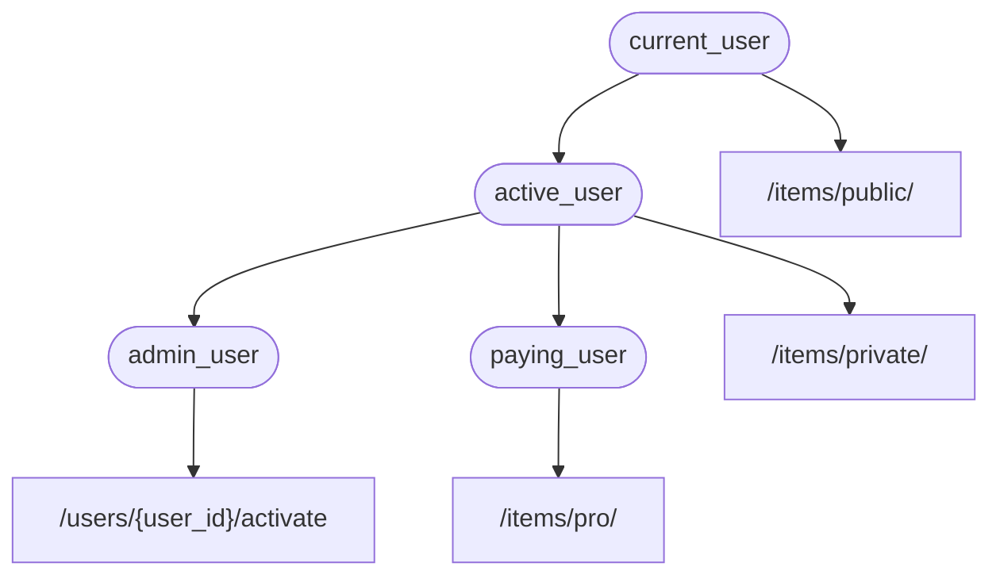

# Bağımlılıklar

**FastAPI** çok güçlü ama sezgisel bir **<abbr title="bileşenler, kaynaklar, sağlayıcılar, hizmetler, enjekte edilebilirler olarak da bilinir">Bağımlılık Enjeksiyonu</abbr>** sistemine sahiptir.

Kullanımı çok basit olacak şekilde tasarlanmıştır ve herhangi bir geliştiricinin diğer bileşenleri **FastAPI** ile entegre etmesini çok kolaylaştırır.

## "Bağımlılık Enjeksiyonu" Nedir

**"Bağımlılık Enjeksiyonu"**, programlamada, kodunuzun (bu durumda *yol operasyonu fonksiyonlarınızın*) çalışması ve kullanması için ihtiyaç duyduğu şeyleri bildirmesinin bir yolu olduğu anlamına gelir: "bağımlılıklar".

Ve ardından, bu sistem (bu durumda **FastAPI**) kodunuza bu gerekli bağımlılıkları sağlamak (bağımlılıkları "enjekte etmek") için gereken her şeyi yapacaktır.

Bu, aşağıdaki durumlarda çok kullanışlıdır:

* Paylaşılan mantığa sahip olma (aynı kod mantığını tekrar tekrar).
* Veritabanı bağlantılarını paylaşma.
* Güvenlik, kimlik doğrulama, rol gereksinimleri vb.'yi zorunlu kılma.
* Ve daha birçok şey...

Bunların hepsi, kod tekrarını en aza indirirken.

## İlk Adımlar

Çok basit bir örnek görelim. O kadar basit olacak ki şu an için çok kullanışlı değil.

Ama bu şekilde **Bağımlılık Enjeksiyonu** sisteminin nasıl çalıştığına odaklanabiliriz.

### Bir bağımlılık oluşturun veya "bağımlı olunabilir"

Önce bağımlılığa odaklanalım.

Bu, bir *yol operasyonu fonksiyonunun* alabileceği tüm aynı parametreleri alabilen bir fonksiyondur:

{* ../../docs_src/dependencies/tutorial001_an_py310.py hl[8:9] *}

İşte bu kadar.

**2 satır**.

Ve tüm *yol operasyonu fonksiyonlarınızın* sahip olduğu aynı şekle ve yapıya sahiptir.

Bunu "dekoratör" olmadan (yani `@app.get("/some-path")` olmadan) bir *yol operasyonu fonksiyonu* olarak düşünebilirsiniz.

Ve istediğiniz herhangi bir şeyi döndürebilir.

Bu durumda, bu bağımlılık şunları bekler:

* `str` olan isteğe bağlı bir `q` sorgu parametresi.
* Varsayılan olarak `0` olan, `int` tipinde isteğe bağlı bir `skip` sorgu parametresi.
* Varsayılan olarak `100` olan, `int` tipinde isteğe bağlı bir `limit` sorgu parametresi.

Ve sonra bu değerleri içeren bir `dict` döndürür.

/// info

FastAPI, 0.95.0 sürümünde `Annotated` desteği ekledi (ve önermeye başladı).

Eski bir sürümünüz varsa, `Annotated` kullanmaya çalışırken hatalar alırsınız.

`Annotated` kullanmadan önce [FastAPI sürümünü](../../deployment/versions.md#upgrading-the-fastapi-versions){.internal-link target=_blank} en az 0.95.1'e yükselttiğinizden emin olun.

///

### `Depends`'i içe aktarın

{* ../../docs_src/dependencies/tutorial001_an_py310.py hl[3] *}

### Bağımlılığı "bağımlı" içinde bildirin

*Yol operasyonu fonksiyon* parametrelerinizle `Body`, `Query` vb. kullandığınız şekilde, yeni bir parametre ile `Depends` kullanın:

{* ../../docs_src/dependencies/tutorial001_an_py310.py hl[13,18] *}

`Body`, `Query` vb. ile fonksiyonunuzun parametrelerinde `Depends` kullanmanıza rağmen, `Depends` biraz farklı çalışır.

`Depends`'e yalnızca tek bir parametre verirsiniz.

Bu parametre bir fonksiyon gibi bir şey olmalıdır.

Onu doğrudan **çağırmazsınız** (sonuna parantez eklemeyin), sadece `Depends()`'e bir parametre olarak iletirsiniz.

Ve bu fonksiyon, *yol operasyonu fonksiyonlarının* yaptığı gibi parametreleri alır.

/// tip

Fonksiyonların dışında bağımlılık olarak hangi "şeylerin" kullanılabileceğini bir sonraki bölümde göreceksiniz.

///

Yeni bir istek geldiğinde, **FastAPI** şunları yapacaktır:

* Bağımlılık ("bağımlı olunabilir") fonksiyonunuzu doğru parametrelerle çağırma.
* Fonksiyonunuzdan sonucu alma.
* Bu sonucu *yol operasyonu fonksiyonunuzdaki* parametreye atama.



Bu şekilde paylaşılan kodu bir kez yazarsınız ve **FastAPI** onu *yol operasyonlarınız* için çağırmayı halleder.

/// check

Özel bir sınıf oluşturup **FastAPI**'ye "kaydetmek" veya benzeri bir şey yapmak için bir yere iletmenize gerek olmadığına dikkat edin.

Sadece `Depends`'e iletirsiniz ve **FastAPI** gerisini nasıl yapacağını bilir.

///

## `Annotated` bağımlılıklarını paylaşma

Yukarıdaki örneklerde, biraz **kod tekrarı** olduğunu görüyorsunuz.

`common_parameters()` bağımlılığını kullanmanız gerektiğinde, tüm parametreyi tip açıklaması ve `Depends()` ile yazmanız gerekir:

```Python
commons: Annotated[dict, Depends(common_parameters)]
```

Ancak `Annotated` kullandığımız için, bu `Annotated` değerini bir değişkende saklayabilir ve birden fazla yerde kullanabiliriz:

{* ../../docs_src/dependencies/tutorial001_02_an_py310.py hl[12,16,21] *}

/// tip

Bu standart Python'dur, buna "tip takma adı" denir, aslında **FastAPI**'ye özgü değildir.

Ancak **FastAPI**, `Annotated` dahil Python standartlarına dayandığı için, bu numarayı kodunuzda kullanabilirsiniz. 😎

///

Bağımlılıklar beklendiği gibi çalışmaya devam edecektir ve **en iyi kısmı**, **tip bilgisinin korunacağıdır**, yani editörünüz size **otomatik tamamlama**, **satır içi hatalar** vb. sağlamaya devam edecektir. `mypy` gibi diğer araçlar için de aynı.

Bu, özellikle **birçok *yol operasyonunda*** **aynı bağımlılıkları** tekrar tekrar kullandığınız **büyük bir kod tabanında** çok kullanışlı olacaktır.

## `async` veya `async` değil

Bağımlılıklar **FastAPI** tarafından da çağrılacağından (*yol operasyonu fonksiyonlarınız* ile aynı), fonksiyonlarınızı tanımlarken aynı kurallar geçerlidir.

`async def` veya normal `def` kullanabilirsiniz.

Ve normal `def` *yol operasyonu fonksiyonları* içinde `async def` bağımlılıklarını veya `async def` *yol operasyonu fonksiyonları* içinde `def` bağımlılıklarını bildirebilirsiniz, vb.

Fark etmez. **FastAPI** ne yapacağını bilecektir.

/// note

Bilmiyorsanız, belgelerdeki [Async: *"Aceleniz mi var?"*](../../async.md#in-a-hurry){.internal-link target=_blank} bölümünü `async` ve `await` hakkında kontrol edin.

///

## OpenAPI ile entegre

Bağımlılıklarınızın (ve alt bağımlılıklarınızın) tüm istek bildirimleri, doğrulamaları ve gereksinimleri aynı OpenAPI şemasına entegre edilecektir.

Bu yüzden, etkileşimli belgeler bu bağımlılıklardan gelen tüm bilgilere de sahip olacaktır:


## Basit kullanım

Bakarsanız, *yol operasyonu fonksiyonları* bir *yol* ve *operasyon* eşleştiğinde kullanılmak üzere bildirilir ve ardından **FastAPI** istekten veriyi çıkararak doğru parametrelerle fonksiyonu çağırmayı halleder.

Aslında, tüm (veya çoğu) web framework'leri aynı şekilde çalışır.

Bu fonksiyonları asla doğrudan çağırmazsınız. Framework'ünüz (bu durumda **FastAPI**) tarafından çağrılırlar.

Bağımlılık Enjeksiyonu sistemiyle, **FastAPI**'ye *yol operasyonu fonksiyonunuzun* da *yol operasyonu fonksiyonunuzdan* önce çalıştırılması gereken başka bir şeye "bağımlı" olduğunu söyleyebilirsiniz ve **FastAPI** onu çalıştırıp sonuçları "enjekte etmeyi" halleder.

"Bağımlılık enjeksiyonu" ile aynı fikir için diğer yaygın terimler:

* kaynaklar
* sağlayıcılar
* hizmetler
* enjekte edilebilirler
* bileşenler

## **FastAPI** eklentileri

Entegrasyonlar ve "eklentiler" **Bağımlılık Enjeksiyonu** sistemi kullanılarak oluşturulabilir. Ancak aslında, bağımlılıkları kullanarak *yol operasyonu fonksiyonlarınıza* kullanılabilir hale gelen sonsuz sayıda entegrasyon ve etkileşim bildirmek mümkün olduğundan, **"eklenti" oluşturmaya gerek yoktur**.

Ve bağımlılıklar, ihtiyacınız olan Python paketlerini içe aktarmanıza ve bunları birkaç satır kodda API fonksiyonlarınızla entegre etmenize olanak tanıyan çok basit ve sezgisel bir şekilde oluşturulabilir, *tam anlamıyla*.

Bunun örneklerini ilişkisel ve NoSQL veritabanları, güvenlik vb. hakkındaki sonraki bölümlerde göreceksiniz.

## **FastAPI** uyumluluğu

Bağımlılık enjeksiyonu sisteminin basitliği **FastAPI**'yi şunlarla uyumlu hale getirir:

* tüm ilişkisel veritabanları
* NoSQL veritabanları
* harici paketler
* harici API'ler
* kimlik doğrulama ve yetkilendirme sistemleri
* API kullanım izleme sistemleri
* yanıt veri enjeksiyonu sistemleri
* vb.

## Basit ve Güçlü

Hiyerarşik bağımlılık enjeksiyonu sistemi tanımlanması ve kullanılması çok basit olsa da, yine de çok güçlüdür.

Kendileri de bağımlılıklar tanımlayabilen bağımlılıklar tanımlayabilirsiniz.

Sonuçta, hiyerarşik bir bağımlılık "grafiği" (ağacı) oluşturulur ve **Bağımlılık Enjeksiyonu** sistemi tüm bu bağımlılıkları (ve bunların alt bağımlılıklarını) sizin için çözmeyi ve her adımda sonuçları sağlamayı (enjekte etmeyi) halleder.

Örneğin, 4 API uç noktanız (*yol operasyonları*) olduğunu varsayalım:

* `/items/public/`
* `/items/private/`
* `/users/{user_id}/activate`
* `/items/pro/`

o zaman sadece bağımlılıklar ve alt bağımlılıklarla her biri için farklı izin gereksinimleri ekleyebilirsiniz:



## **OpenAPI** ile entegre

Tüm bu bağımlılıklar, gereksinimlerini bildirirken, *yol operasyonlarınıza* parametreler, doğrulamalar vb. de ekler.

**FastAPI** bunların hepsini OpenAPI şemasına eklemeyi halleder, böylece etkileşimli belge sistemlerinde gösterilir.
