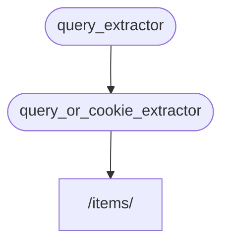

# Alt Bağımlılıklar

**Alt bağımlılıklara** sahip bağımlılıklar oluşturabilirsiniz.

İhtiyacınız olduğu kadar **derin** olabilirler.

**FastAPI** bunları çözmeyi halleder.

## İlk bağımlılık "bağımlı olunabilir"

Şöyle bir ilk bağımlılık ("bağımlı olunabilir") oluşturabilirsiniz:

{* ../../docs_src/dependencies/tutorial005_an_py310.py hl[8:9] *}

`str` olarak isteğe bağlı bir `q` sorgu parametresi bildirir ve ardından onu döndürür.

Bu oldukça basittir (çok kullanışlı değildir), ancak alt bağımlılıkların nasıl çalıştığına odaklanmamıza yardımcı olacaktır.

## İkinci bağımlılık, "bağımlı olunabilir" ve "bağımlı"

Ardından, kendi bağımlılığını da bildiren başka bir bağımlılık fonksiyonu ("bağımlı olunabilir") oluşturabilirsiniz (yani aynı zamanda bir "bağımlı"dır):

{* ../../docs_src/dependencies/tutorial005_an_py310.py hl[13] *}

Bildirilen parametrelere odaklanalım:

* Bu fonksiyon kendisi bir bağımlılık ("bağımlı olunabilir") olmasına rağmen, aynı zamanda başka bir bağımlılık bildirir (başka bir şeye "bağımlıdır").
    * `query_extractor`'a bağımlıdır ve onun döndürdüğü değeri `q` parametresine atar.
* Ayrıca `str` olarak isteğe bağlı bir `last_query` çerezi bildirir.
    * Kullanıcı herhangi bir `q` sorgusu sağlamadıysa, daha önce bir çereze kaydettiğimiz son kullanılan sorguyu kullanırız.

## Bağımlılığı kullanın

Ardından bağımlılığı şu şekilde kullanabiliriz:

{* ../../docs_src/dependencies/tutorial005_an_py310.py hl[23] *}

/// info

*Yol operasyonu fonksiyonunda* yalnızca bir bağımlılık bildirdiğimize dikkat edin, `query_or_cookie_extractor`.

Ancak **FastAPI**, onu çağırırken `query_or_cookie_extractor`'a sonuçları iletmek için önce `query_extractor`'ı çözmesi gerektiğini bilecektir.

///



## Aynı bağımlılığı birden fazla kez kullanma

Bağımlılıklarınızdan biri aynı *yol operasyonu* için birden fazla kez bildirilmişse, örneğin, birden fazla bağımlılığın ortak bir alt bağımlılığı varsa, **FastAPI** bu alt bağımlılığı istek başına yalnızca bir kez çağırmayı bilecektir.

Ve döndürülen değeri bir <abbr title="Hesaplanmış/oluşturulmuş değerleri tekrar hesaplamak yerine yeniden kullanmak için saklayan bir yardımcı program/sistem.">"önbellek"</abbr>e kaydedecek ve aynı istek için bağımlılığı birden fazla kez çağırmak yerine o belirli istekte ihtiyaç duyan tüm "bağımlılara" iletecektir.

"Önbelleğe alınmış" değeri kullanmak yerine bağımlılığın aynı istekte her adımda (muhtemelen birden fazla kez) çağrılmasına ihtiyacınız olan gelişmiş bir senaryoda, `Depends` kullanırken `use_cache=False` parametresini ayarlayabilirsiniz:

//// tab | Python 3.8+

```Python hl_lines="1"
async def needy_dependency(fresh_value: Annotated[str, Depends(get_value, use_cache=False)]):
    return {"fresh_value": fresh_value}
```

////

//// tab | Python 3.8+ non-Annotated

/// tip

Mümkünse `Annotated` sürümünü kullanmayı tercih edin.

///

```Python hl_lines="1"
async def needy_dependency(fresh_value: str = Depends(get_value, use_cache=False)):
    return {"fresh_value": fresh_value}
```

////

## Özet

Burada kullanılan tüm süslü kelimelerin dışında, **Bağımlılık Enjeksiyonu** sistemi oldukça basittir.

Sadece *yol operasyonu fonksiyonlarıyla* aynı görünen fonksiyonlar.

Ama yine de çok güçlüdür ve keyfi olarak derinlemesine iç içe geçmiş bağımlılık "grafikleri" (ağaçları) bildirmenize olanak tanır.

/// tip

Bunların hepsi bu basit örneklerle çok kullanışlı görünmeyebilir.

Ancak **güvenlik** hakkındaki bölümlerde ne kadar kullanışlı olduğunu göreceksiniz.

Ve size ne kadar kod kazandıracağını da göreceksiniz.

///
