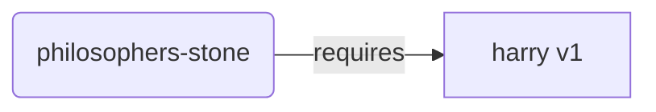
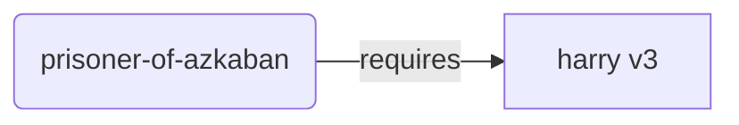
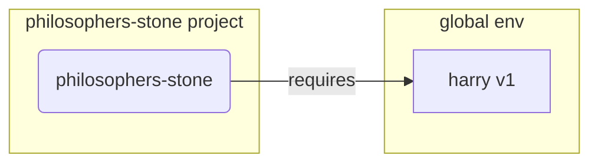
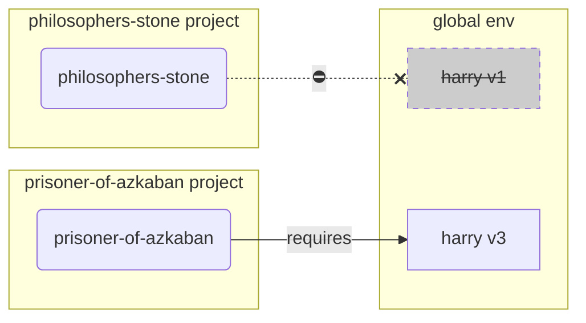
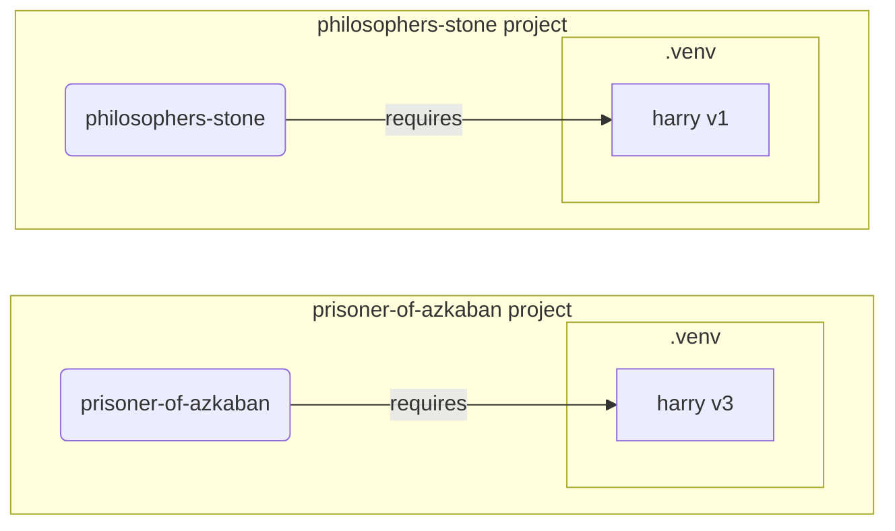

# Sanal Ortamlar

Python projelerinde çalışırken muhtemelen her proje için yüklediğiniz paketleri izole etmek için bir **sanal ortam** (veya benzer bir mekanizma) kullanmalısınız.

/// info

Sanal ortamlar hakkında zaten bilgi sahibiyseniz, bunları nasıl oluşturup kullanacağınızı biliyorsanız, bu bölümü atlayabilirsiniz. 🤓

///

/// tip

Bir **sanal ortam**, bir **ortam değişkeninden** farklıdır.

Bir **ortam değişkeni**, programlar tarafından kullanılabilen sistemdeki bir değişkendir.

Bir **sanal ortam** ise içinde bazı dosyalar bulunan bir dizindir.

///

/// info

Bu sayfa size **sanal ortamları** nasıl kullanacağınızı ve nasıl çalıştıklarını öğretecektir.

**Her şeyi sizin için yöneten bir araç** kullanmaya hazırsanız (Python yükleme dahil), <a href="https://github.com/astral-sh/uv" class="external-link" target="_blank">uv</a>'yu deneyin.

///

## Proje Oluşturma

İlk olarak, projeniz için bir dizin oluşturun.

Normalde yaptığım şey, ev/kullanıcı dizinimin içinde `code` adlı bir dizin oluşturmaktır.

Ve onun içinde her proje için bir dizin oluşturuyorum.

<div class="termy">

```console
// Go to the home directory
$ cd
// Create a directory for all your code projects
$ mkdir code
// Enter into that code directory
$ cd code
// Create a directory for this project
$ mkdir awesome-project
// Enter into that project directory
$ cd awesome-project
```

</div>

## Sanal Ortam Oluşturma

Bir Python projesinde **ilk kez** çalışmaya başladığınızda, **<abbr title="başka seçenekler de var, bu basit bir kılavuzdur">projenizin içinde</abbr>** bir sanal ortam oluşturun.

/// tip

Bunu **proje başına yalnızca bir kez** yapmanız gerekir, her çalıştığınızda değil.

///

//// tab | `venv`

Sanal ortam oluşturmak için Python ile birlikte gelen `venv` modülünü kullanabilirsiniz.

<div class="termy">

```console
$ python -m venv .venv
```

</div>

/// details | Bu komut ne anlama geliyor

* `python`: `python` adlı programı kullan
* `-m`: bir modülü betik olarak çağır, hangi modül olduğunu sonra söyleyeceğiz
* `venv`: normalde Python ile birlikte yüklü gelen `venv` adlı modülü kullan
* `.venv`: sanal ortamı yeni `.venv` dizininde oluştur

///

////

//// tab | `uv`

<a href="https://github.com/astral-sh/uv" class="external-link" target="_blank">`uv`</a> yüklüyse, sanal ortam oluşturmak için kullanabilirsiniz.

<div class="termy">

```console
$ uv venv
```

</div>

/// tip

Varsayılan olarak, `uv` `.venv` adlı bir dizinde sanal ortam oluşturacaktır.

Ama dizin adını ek bir argüman geçirerek özelleştirebilirsiniz.

///

////

Bu komut `.venv` adlı bir dizinde yeni bir sanal ortam oluşturur.

/// details | `.venv` veya başka bir isim

Sanal ortamı farklı bir dizinde oluşturabilirsiniz, ama onu `.venv` olarak adlandırma geleneği vardır.

///

## Sanal Ortamı Etkinleştirme

Herhangi bir Python komutunun veya yüklediğiniz paketin onu kullanması için yeni sanal ortamı etkinleştirin.

/// tip

Bunu, projede çalışmak üzere **her yeni terminal oturumu başlattığınızda** yapın.

///

//// tab | Linux, macOS

<div class="termy">

```console
$ source .venv/bin/activate
```

</div>

////

//// tab | Windows PowerShell

<div class="termy">

```console
$ .venv\Scripts\Activate.ps1
```

</div>

////

//// tab | Windows Bash

Veya Windows için Bash kullanıyorsanız (örn. <a href="https://gitforwindows.org/" class="external-link" target="_blank">Git Bash</a>):

<div class="termy">

```console
$ source .venv/Scripts/activate
```

</div>

////

/// tip

O ortamda her yeni **paket yüklediğinizde**, ortamı tekrar **etkinleştirin**.

Bu, o paket tarafından yüklenen bir **terminal (<abbr title="komut satırı arayüzü">CLI</abbr>) programını** kullandığınızda, sanal ortamınızdakini kullanmanızı sağlar, muhtemelen ihtiyacınız olandan farklı bir sürümle global olarak yüklenmiş başka birini değil.

///

## Sanal Ortamın Aktif Olduğunu Kontrol Etme

Sanal ortamın aktif olduğunu kontrol edin (önceki komut çalıştı).

/// tip

Bu **isteğe bağlıdır**, ama her şeyin beklendiği gibi çalıştığını ve amaçladığınız sanal ortamı kullandığınızı **kontrol etmenin** iyi bir yoludur.

///

//// tab | Linux, macOS, Windows Bash

<div class="termy">

```console
$ which python

/home/user/code/awesome-project/.venv/bin/python
```

</div>

Projenizin (bu durumda `awesome-project`) içindeki `.venv/bin/python`'daki `python` ikili dosyasını gösteriyorsa, işe yaramış demektir. 🎉

////

//// tab | Windows PowerShell

<div class="termy">

```console
$ Get-Command python

C:\Users\user\code\awesome-project\.venv\Scripts\python
```

</div>

Projenizin (bu durumda `awesome-project`) içindeki `.venv\Scripts\python`'daki `python` ikili dosyasını gösteriyorsa, işe yaramış demektir. 🎉

////

## `pip`'i Yükseltme

/// tip

<a href="https://github.com/astral-sh/uv" class="external-link" target="_blank">`uv`</a> kullanıyorsanız, `pip` yerine paketleri yüklemek için onu kullanırsınız, bu yüzden `pip`'i yükseltmenize gerek yoktur. 😎

///

Paketleri yüklemek için `pip` kullanıyorsanız (Python ile varsayılan olarak gelir), en son sürüme **yükseltmelisiniz**.

Bir paket yüklerken birçok egzotik hata, sadece önce `pip`'i yükselterek çözülür.

/// tip

Bunu normalde sanal ortamı oluşturduktan hemen sonra **bir kez** yaparsınız.

///

Sanal ortamın aktif olduğundan emin olun (yukarıdaki komutla) ve ardından çalıştırın:

<div class="termy">

```console
$ python -m pip install --upgrade pip

---> 100%
```

</div>

## `.gitignore` Ekleme

**Git** kullanıyorsanız (kullanmalısınız), `.venv` dizininizdeki her şeyi Git'ten hariç tutmak için bir `.gitignore` dosyası ekleyin.

/// tip

Sanal ortamı oluşturmak için <a href="https://github.com/astral-sh/uv" class="external-link" target="_blank">`uv`</a> kullandıysanız, bunu zaten sizin için yapmıştır, bu adımı atlayabilirsiniz. 😎

///

/// tip

Bunu sanal ortamı oluşturduktan hemen sonra **bir kez** yapın.

///

<div class="termy">

```console
$ echo "*" > .venv/.gitignore
```

</div>

/// details | Bu komut ne anlama geliyor

* `echo "*"`: terminalde `*` metnini "yazdıracak" (sonraki kısım bunu biraz değiştirir)
* `>`: `>`'nin solundaki komut tarafından terminale yazdırılan her şey yazdırılmamalı, bunun yerine `>`'nin sağındaki dosyaya yazılmalıdır
* `.gitignore`: metnin yazılacağı dosyanın adı

Ve Git için `*`, "her şey" anlamına gelir. Yani, `.venv` dizinindeki her şeyi yok sayacaktır.

Bu komut şu içerikle bir `.gitignore` dosyası oluşturacaktır:

```gitignore
*
```

///

## Paketleri Yükleme

Ortamı etkinleştirdikten sonra, içine paketler yükleyebilirsiniz.

/// tip

Projenizin ihtiyaç duyduğu paketleri yüklerken veya yükseltirken bunu **bir kez** yapın.

Bir sürümü yükseltmeniz veya yeni bir paket eklemeniz gerekirse bunu **tekrar yaparsınız**.

///

### Paketleri Doğrudan Yükleme

Aceleniz varsa ve projenizin paket gereksinimlerini bildirmek için bir dosya kullanmak istemiyorsanız, bunları doğrudan yükleyebilirsiniz.

/// tip

Programınızın ihtiyaç duyduğu paketleri ve sürümleri bir dosyaya koymak (örneğin `requirements.txt` veya `pyproject.toml`) (çok) iyi bir fikirdir.

///

//// tab | `pip`

<div class="termy">

```console
$ pip install "fastapi[standard]"

---> 100%
```

</div>

////

//// tab | `uv`

<a href="https://github.com/astral-sh/uv" class="external-link" target="_blank">`uv`</a> yüklüyse:

<div class="termy">

```console
$ uv pip install "fastapi[standard]"
---> 100%
```

</div>

////

### `requirements.txt`'den Yükleme

Bir `requirements.txt` dosyanız varsa, artık paketlerini yüklemek için kullanabilirsiniz.

//// tab | `pip`

<div class="termy">

```console
$ pip install -r requirements.txt
---> 100%
```

</div>

////

//// tab | `uv`

<a href="https://github.com/astral-sh/uv" class="external-link" target="_blank">`uv`</a> yüklüyse:

<div class="termy">

```console
$ uv pip install -r requirements.txt
---> 100%
```

</div>

////

/// details | `requirements.txt`

Bazı paketlere sahip bir `requirements.txt` şöyle görünebilir:

```requirements.txt
fastapi[standard]==0.113.0
pydantic==2.8.0
```

///

## Programınızı Çalıştırma

Sanal ortamı etkinleştirdikten sonra, programınızı çalıştırabilirsiniz ve orada yüklediğiniz paketlerle sanal ortamın içindeki Python'u kullanacaktır.

<div class="termy">

```console
$ python main.py

Hello World
```

</div>

## Editörünüzü Yapılandırma

Muhtemelen bir editör kullanacaksınız, oluşturduğunuz aynı sanal ortamı kullanacak şekilde yapılandırdığınızdan emin olun (muhtemelen otomatik olarak algılayacaktır) böylece otomatik tamamlama ve satır içi hatalar alabilirsiniz.

Örneğin:

* <a href="https://code.visualstudio.com/docs/python/environments#_select-and-activate-an-environment" class="external-link" target="_blank">VS Code</a>
* <a href="https://www.jetbrains.com/help/pycharm/creating-virtual-environment.html" class="external-link" target="_blank">PyCharm</a>

/// tip

Bunu normalde sanal ortamı oluşturduğunuzda yalnızca **bir kez** yapmanız gerekir.

///

## Sanal Ortamı Devre Dışı Bırakma

Projeniz üzerinde çalışmayı bitirdiğinizde sanal ortamı **devre dışı bırakabilirsiniz**.

<div class="termy">

```console
$ deactivate
```

</div>

Bu şekilde, `python` çalıştırdığınızda, orada yüklü paketlerle o sanal ortamdan çalıştırmayı denemeyecektir.

## Çalışmaya Hazır

Artık projeniz üzerinde çalışmaya başlamaya hazırsınız.


/// tip

Yukarıdakilerin hepsini anlamak mı istiyorsunuz?

Okumaya devam edin. 👇🤓

///

## Neden Sanal Ortamlar

FastAPI ile çalışmak için <a href="https://www.python.org/" class="external-link" target="_blank">Python</a>'u yüklemeniz gerekir.

Bundan sonra, FastAPI ve kullanmak istediğiniz diğer **paketleri** **yüklemeniz** gerekecektir.

Paketleri yüklemek için normalde Python ile birlikte gelen `pip` komutunu (veya benzer alternatifleri) kullanırsınız.

Yine de, eğer sadece `pip`'i doğrudan kullanırsanız, paketler **global Python ortamınıza** (Python'un global kurulumu) yüklenecektir.

### Sorun

Peki, paketleri global Python ortamına yüklemenin sorunu nedir?

Bir noktada, muhtemelen **farklı paketlere** bağlı birçok farklı program yazmaya başlayacaksınız. Ve üzerinde çalıştığınız bu projelerin bazıları aynı paketin **farklı sürümlerine** bağlı olacaktır. 😱

Örneğin, `philosophers-stone` adlı bir proje oluşturabilirsiniz, bu program **`harry`, sürüm `1`** adlı başka bir pakete bağlıdır. Bu yüzden `harry`'yi yüklemeniz gerekir.



Sonra, bir süre sonra, `prisoner-of-azkaban` adlı başka bir proje oluşturursunuz ve bu proje de `harry`'ye bağlıdır, ama bu proje **`harry` sürüm `3`** gerektirir.



Ama şimdi sorun şu ki, paketleri global olarak (global ortamda) yerel bir **sanal ortam** yerine yüklerseniz, `harry`'nin hangi sürümünü yükleyeceğinizi seçmek zorunda kalacaksınız.

`philosophers-stone`'u çalıştırmak istiyorsanız, önce `harry` sürüm `1`'i yüklemeniz gerekecek, örneğin:

<div class="termy">

```console
$ pip install "harry==1"
```

</div>

Ve sonra global Python ortamınızda `harry` sürüm `1` yüklü olacaktır.



Ama sonra `prisoner-of-azkaban`'ı çalıştırmak istiyorsanız, `harry` sürüm `1`'i kaldırmanız ve `harry` sürüm `3`'ü yüklemeniz gerekecek (veya sadece sürüm `3`'ü yüklemek otomatik olarak sürüm `1`'i kaldıracaktır).

<div class="termy">

```console
$ pip install "harry==3"
```

</div>

Ve sonra global Python ortamınızda `harry` sürüm `3` yüklü olacaktır.

Ve `philosophers-stone`'u tekrar çalıştırmayı denerseniz, `harry` sürüm `1`'e ihtiyacı olduğu için **çalışmama** ihtimali vardır.



/// tip

Python paketlerinde **yeni sürümlerde** **kırıcı değişikliklerden kaçınmaya** çalışmak çok yaygındır, ama güvende olmak ve yeni sürümleri kasıtlı olarak ve her şeyin doğru çalıştığını kontrol etmek için testleri çalıştırabildiğinizde yüklemek daha iyidir.

///

Şimdi, bunu tüm **projelerinizin bağlı olduğu** **birçok** diğer **paket** ile düşünün. Bu yönetimi çok zordur. Ve muhtemelen bazı projeleri paketlerin bazı **uyumsuz sürümleriyle** çalıştırırsınız ve bir şeyin neden çalışmadığını bilemezsiniz.

Ayrıca, işletim sisteminize bağlı olarak (örn. Linux, Windows, macOS), Python zaten yüklü olarak gelmiş olabilir. Ve bu durumda muhtemelen **sisteminiz tarafından ihtiyaç duyulan** bazı belirli sürümlerle önceden yüklenmiş bazı paketler vardır. Paketleri global Python ortamına yüklerseniz, işletim sisteminizle birlikte gelen bazı programları **bozabilirsiniz**.

## Paketler Nereye Yüklenir

Python'u yüklediğinizde, bilgisayarınızda bazı dosyalarla birlikte bazı dizinler oluşturur.

Bu dizinlerin bazıları, yüklediğiniz tüm paketlere sahip olma sorumluluğundaki dizinlerdir.

Şunu çalıştırdığınızda:

<div class="termy">

```console
// Don't run this now, it's just an example 🤓
$ pip install "fastapi[standard]"
---> 100%
```

</div>

Bu, normalde <a href="https://pypi.org/project/fastapi/" class="external-link" target="_blank">PyPI</a>'den FastAPI koduyla sıkıştırılmış bir dosya indirecektir.

Ayrıca FastAPI'nin bağımlı olduğu diğer paketler için de dosyaları **indirecektir**.

Sonra tüm bu dosyaları **çıkaracak** ve bilgisayarınızdaki bir dizine koyacaktır.

Varsayılan olarak, indirilen ve çıkarılan dosyaları Python kurulumunuzla birlikte gelen dizine koyacaktır, bu **global ortamdır**.

## Sanal Ortamlar Nedir

Global ortamda tüm paketlerin olmasının sorunlarına çözüm, üzerinde çalıştığınız **her proje için bir sanal ortam** kullanmaktır.

Sanal ortam bir **dizindir**, global olanla çok benzer, projeniz için paketleri yükleyebileceğiniz bir yer.

Bu şekilde, her projenin kendi sanal ortamı (`.venv` dizini) ve kendi paketleri olacaktır.



## Sanal Ortamı Etkinleştirmek Ne Anlama Gelir

Sanal ortamı etkinleştirdiğinizde, örneğin:

//// tab | Linux, macOS

<div class="termy">

```console
$ source .venv/bin/activate
```

</div>

////

//// tab | Windows PowerShell

<div class="termy">

```console
$ .venv\Scripts\Activate.ps1
```

</div>

////

//// tab | Windows Bash

Veya Windows için Bash kullanıyorsanız (örn. <a href="https://gitforwindows.org/" class="external-link" target="_blank">Git Bash</a>):

<div class="termy">

```console
$ source .venv/Scripts/activate
```

</div>

////

Bu komut, sonraki komutlar için kullanılabilir olacak bazı [ortam değişkenlerini](environment-variables.md){.internal-link target=_blank} oluşturacak veya değiştirecektir.

Bu değişkenlerden biri `PATH` değişkenidir.

/// tip

`PATH` ortam değişkeni hakkında [Ortam Değişkenleri](environment-variables.md#path-ortam-degiskeni){.internal-link target=_blank} bölümünde daha fazla bilgi edinebilirsiniz.

///

Sanal ortamı etkinleştirmek, `PATH` ortam değişkenine `.venv/bin` (Linux ve macOS'ta) veya `.venv\Scripts` (Windows'ta) yolunu ekler.

Ortamı etkinleştirmeden önce `PATH` değişkeninin şöyle göründüğünü varsayalım:

//// tab | Linux, macOS

```plaintext
/usr/bin:/bin:/usr/sbin:/sbin
```

Bu, sistemin programları şuralarda arayacağı anlamına gelir:

* `/usr/bin`
* `/bin`
* `/usr/sbin`
* `/sbin`

////

//// tab | Windows

```plaintext
C:\Windows\System32
```

Bu, sistemin programları şurada arayacağı anlamına gelir:

* `C:\Windows\System32`

////

Sanal ortamı etkinleştirdikten sonra, `PATH` değişkeni şöyle bir şeye benzeyecektir:

//// tab | Linux, macOS

```plaintext
/home/user/code/awesome-project/.venv/bin:/usr/bin:/bin:/usr/sbin:/sbin
```

Bu, sistemin artık önce şurada programları aramaya başlayacağı anlamına gelir:

```plaintext
/home/user/code/awesome-project/.venv/bin
```

diğer dizinlere bakmadan önce.

Yani, terminalde `python` yazdığınızda, sistem Python programını şurada bulacaktır:

```plaintext
/home/user/code/awesome-project/.venv/bin/python
```

ve onu kullanacaktır.

////

//// tab | Windows

```plaintext
C:\Users\user\code\awesome-project\.venv\Scripts;C:\Windows\System32
```

Bu, sistemin artık önce şurada programları aramaya başlayacağı anlamına gelir:

```plaintext
C:\Users\user\code\awesome-project\.venv\Scripts
```

diğer dizinlere bakmadan önce.

Yani, terminalde `python` yazdığınızda, sistem Python programını şurada bulacaktır:

```plaintext
C:\Users\user\code\awesome-project\.venv\Scripts\python
```

ve onu kullanacaktır.

////

Önemli bir detay, sanal ortam yolunu `PATH` değişkeninin **başına** koymasıdır. Sistem, mevcut diğer Python'lardan **önce** onu bulacaktır. Bu şekilde, `python` çalıştırdığınızda, başka bir `python` (örneğin, global ortamdaki bir `python`) yerine **sanal ortamdaki** Python'u kullanacaktır.

Sanal ortamı etkinleştirmek birkaç şeyi daha değiştirir, ama yaptığı en önemli şeylerden biri budur.

## Sanal Ortamı Kontrol Etme

Sanal ortamın aktif olup olmadığını kontrol ettiğinizde, örneğin:

//// tab | Linux, macOS, Windows Bash

<div class="termy">

```console
$ which python

/home/user/code/awesome-project/.venv/bin/python
```

</div>

////

//// tab | Windows PowerShell

<div class="termy">

```console
$ Get-Command python

C:\Users\user\code\awesome-project\.venv\Scripts\python
```

</div>

////

Bu, kullanılacak `python` programının **sanal ortamdaki** olduğu anlamına gelir.

Linux ve macOS'ta `which`, Windows PowerShell'de `Get-Command` kullanırsınız.

Bu komutun çalışma şekli, `PATH` ortam değişkenine gidip **her yolu sırayla** kontrol ederek `python` adlı programı aramasıdır. Bulduğunda, o programa giden **yolu gösterecektir**.

En önemli kısım, `python`'u çağırdığınızda, çalıştırılacak olan tam olarak o "`python`" olacaktır.

Böylece doğru sanal ortamda olup olmadığınızı doğrulayabilirsiniz.

/// tip

Bir sanal ortamı etkinleştirmek, bir Python almak ve sonra **başka bir projeye gitmek** kolaydır.

Ve ikinci proje **çalışmayacaktır** çünkü başka bir proje için sanal ortamdan **yanlış Python'u** kullanıyorsunuzdur.

Hangi `python`'un kullanıldığını kontrol edebilmek yararlıdır. 🤓

///

## Sanal Ortamı Neden Devre Dışı Bırakmalı

Örneğin, bir `philosophers-stone` projesi üzerinde çalışıyor olabilirsiniz, **o sanal ortamı etkinleştirip**, paketler yükleyip o ortamla çalışabilirsiniz.

Ve sonra **başka bir proje** olan `prisoner-of-azkaban` üzerinde çalışmak isteyebilirsiniz.

O projeye gidersiniz:

<div class="termy">

```console
$ cd ~/code/prisoner-of-azkaban
```

</div>

`philosophers-stone` için sanal ortamı devre dışı bırakmazsanız, terminalde `python` çalıştırdığınızda, `philosophers-stone`'dan Python'u kullanmaya çalışacaktır.

<div class="termy">

```console
$ cd ~/code/prisoner-of-azkaban

$ python main.py

// Error importing sirius, it's not installed 😱
Traceback (most recent call last):
    File "main.py", line 1, in <module>
        import sirius
```

</div>

Ama sanal ortamı devre dışı bırakıp `prisoner-of-azkaban` için yenisini etkinleştirirseniz, `python` çalıştırdığınızda `prisoner-of-azkaban`'daki sanal ortamdan Python'u kullanacaktır.

<div class="termy">

```console
$ cd ~/code/prisoner-of-azkaban

// You don't need to be in the old directory to deactivate, you can do it wherever you are, even after going to the other project 😎
$ deactivate

// Activate the virtual environment in prisoner-of-azkaban/.venv 🚀
$ source .venv/bin/activate

// Now when you run python, it will find the package sirius installed in this virtual environment ✨
$ python main.py

I solemnly swear 🐺
```

</div>

## Alternatifler

Bu, başlamanız ve her şeyin **altında** nasıl çalıştığını öğretmeniz için basit bir kılavuzdur.

Sanal ortamları, paket bağımlılıklarını (gereksinimler) ve projeleri yönetmek için birçok **alternatif** vardır.

Hazır olduğunuzda ve **tüm projeyi**, paket bağımlılıklarını, sanal ortamları vb. **yönetecek bir araç** kullanmak istediğinizde, <a href="https://github.com/astral-sh/uv" class="external-link" target="_blank">uv</a>'yu denemenizi öneririm.

`uv` birçok şey yapabilir, şunları yapabilir:

* Farklı sürümler dahil sizin için **Python yükleyebilir**
* Projeleriniz için **sanal ortamı** yönetebilir
* **Paketleri** yükleyebilir
* Projeniz için paket **bağımlılıklarını ve sürümlerini** yönetebilir
* Yüklenecek **tam** bir paket ve sürüm kümesine sahip olduğunuzdan emin olabilir, bağımlılıkları dahil, böylece geliştirme sırasında bilgisayarınızda olduğu gibi üretimde de projenizi tam olarak aynı şekilde çalıştırabileceğinizden emin olabilirsiniz, buna **kilitleme** denir
* Ve daha birçok şey

## Sonuç

Tüm bunları okuduysanız ve anladıysanız, artık birçok geliştiriciden **çok daha fazlasını biliyorsunuz** sanal ortamlar hakkında. 🤓

Bu ayrıntıları bilmek, muhtemelen gelecekte karmaşık görünen bir şeyde hata ayıklarken yararlı olacaktır, ama **her şeyin altında nasıl çalıştığını bileceksiniz**. 😎
